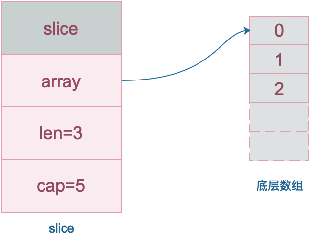

下面两段代码输出什么。

```go
// 1.
func main() {
    s := make([]int, 5)
    s = append(s, 1, 2, 3)
    fmt.Println(s)
}

// 2.
func main() {
    s := make([]int, 0)
    s = append(s, 1, 2, 3, 4)
    fmt.Println(s)
}
```



```go
// 1
[0 0 0 0 0 1 2 3]

// 2
[1 2 3 4]
```

解析：首先了解一下切片的结构。

```go
// runtime/slice.go
type slice struct {
    array unsafe.Pointer // 元素指针
    len   int // 长度 
    cap   int // 容量
}
```



> slice 实际上是一个结构体，包含三个字段：长度、容量、底层数组。

`make([]int, 5)` 等价于 `make([]int, 5, 5)`，会创建一个 len = 5 cap = 5 的切片。`s = append(s, 1, 2, 3)` 会在切片长度(5)的后面增加 1, 2, 3。

```go
底层数组[5] = 1
底层数组[6] = 2
底层数组[7] = 3
```

题目2 创建一个 len = 0 cap = 0 的切片。

参考资料：

- 🔗: [数组和切片有什么不同](https://golang.design/go-questions/slice/vs-array/)
- 🔗📺️: [【Golang】slice类型存什么？make和new？slice和数组？扩容规则](https://www.bilibili.com/video/BV1CV411d7W8/?spm_id_from=333.999.0.0&vd_source=2efe9e7b9d8ada5878fa15a7ad28b0dd)
- 🔗: [制作分片、映射和信道](https://hao.studygolang.com/golang_spec.html#make)
- 🔗: [添加到和拷贝分片](https://hao.studygolang.com/golang_spec.html#id224)


