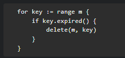

Go 的 map 可以边遍历边删除吗？



答：理论上可以。

<https://go.dev/doc/effective_go#for> ， 这个官方例子也展示了可以在遍历的时候删除。
<https://go.dev/ref/spec#For_statements> ， 同时官方的range迭代也有说着遍历时删除和新增的情况

# 但是清注意

map 并不是一个线程安全的数据结构。同时读写一个 map 是未定义的行为，如果被检测到，会直接 `panic`。
并发的去读写map是十分危险的,建议直接用``m=make(map[T]T)``生成新的map对象,老的map让GC自动回收内存空间


