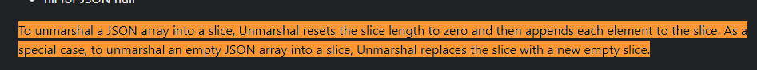

下面这段代码输出什么？

```go
package main

import (
    "encoding/json"
    "fmt"
)

type AutoGenerated struct {
    Age   int    `json:"age"`
    Name  string `json:"name"`
    Child []int  `json:"child"`
}

func main() {
    jsonStr1 := `{"age": 14,"name": "potter", "child":[1,2,3]}`
    a := AutoGenerated{}
    json.Unmarshal([]byte(jsonStr1), &a)
    aa := a.Child
    fmt.Println(aa)
    jsonStr2 := `{"age": 12,"name": "potter", "child":[3,4,5,7,8,9]}`
    json.Unmarshal([]byte(jsonStr2), &a)
    fmt.Println(aa)
}
```

- A：[1 2 3] [1 2 3] ；
- B：[1 2 3] [3 4 5]；
- C：[1 2 3] [3 4 5 6 7 8 9]；
- D：[1 2 3] [3 4 5 0 0 0]



答: B  [在线运行](https://go.dev/play/p/BRdAwDKfZt4)

解析: 如题中 2次打印的变量都是 `aa` 变量。

aa 切片的内容和 a.Child切片内容是一样的(指向同一个底层数组)

- 问题一 为什么jsonStr2 Unmarshal 会修改到 aa 切片的内容?
- 问题二 为什么Unmarshal运行后aa 切片的内容不是3,4,5,7,8,9

上2个问题其实都可以在Go文档中得到答案

- 官方(英文)<https://pkg.go.dev/encoding/json#Unmarshal>


> 为了将一个 JSON 数组反序列化为切片，Unmarshal 会将切片的`长度重置为零`，然后将每个元素`依次` `追加`到切片中。作为一个特殊情况，当反序列化一个空的 JSON 数组时，Unmarshal 会用一个新的空切片替换原有的切片。

也即是说,Go Json 库Unmarshal时 遇到切片的时候 本质上是

```go
a.Child = a.Child[:0] 
a.Child = append(a.Child, 3)
a.Child = append(a.Child, 4)
a.Child = append(a.Child, 5)
a.Child = append(a.Child, 6)
a.Child = append(a.Child, 7)
a.Child = append(a.Child, 8)
a.Child = append(a.Child, 9)
```

[在线运行](https://go.dev/play/p/glVhEWL2Cej)

 `问题一` 由于aa和a.Child共用的是同一个底层数组,因此会互相影响

 `问题二` 但是append(a.Child, 6)时,a.Child触发了扩容机制。a.Child指向了一个新的底层地址,后续的append就不影响了


