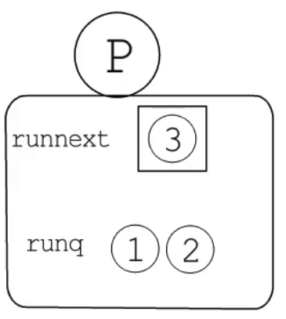

下方代码输出什么并解释一下

```go
package main

import (
       "runtime"
       "sync"
)

func main() {
       runtime.GOMAXPROCS(1)

       var wg sync.WaitGroup
       wg.Add(3)
       go func(n int) {
              println(n)
              wg.Done()
       }(1)
       go func(n int) {
              println(n)
              wg.Done()
       }(2)
       go func(n int) {
              println(n)
              wg.Done()
       }(3)
       wg.Wait()
}
```



[在线运行](https://go.dev/play/p/XqH_qtG5s5C)

```
3
1
2
```

浅谈：
go函数会创建新的G，P里面有一个记录下一个运行的G 和一个本地队列（类似手枪上膛）。1G 2G 3G 依次进入P。最后就是下一个运行的G 是3G 队列里面是 1G、2G

深谈：
runtime.GOMAXPROCS(1)的作用是限制P的数量为1
go 函数本质会调用 newproc ，newproc会调用newproc1
newproc1 会初始化新的G，然后调用runqput将G添加到P。P中有一个本地runq 和 runnext 。先进入runnext，第二个G来了先把第一个G从runnetx中挤到了本地runq。注意这个本地runq的长度为256。因此会先运行runnetx中3G，然后依次运行1G、2G



