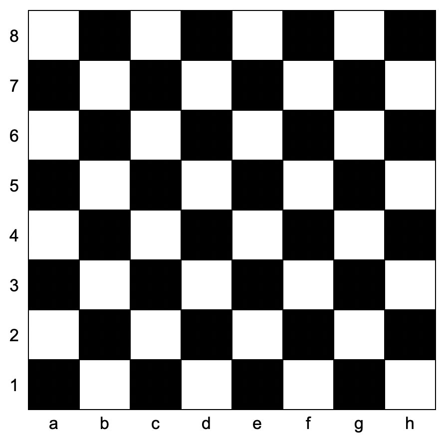

力扣链接:[1812. 判断国际象棋棋盘中一个格子的颜色](https://leetcode.cn/problems/determine-color-of-a-chessboard-square/description/?envType=daily-question&envId=2024-12-09)

力扣难度 `简单`

---
题目:
给你一个坐标 coordinates ，它是一个字符串，表示国际象棋棋盘中一个格子的坐标。下图是国际象棋棋盘示意图。



如果所给格子的颜色是白色，请你返回 true，如果是黑色，请返回 false 。

给定坐标一定代表国际象棋棋盘上一个存在的格子。坐标第一个字符是字母，第二个字符是数字。

示例 1：

>输入：coordinates = "a1"
>输出：false
>解释：如上图棋盘所示，"a1" 坐标的格子是黑色的，所以返回 false 。

示例 2：

>输入：coordinates = "h3"
>输出：true
>解释：如上图棋盘所示，"h3" 坐标的格子是白色的，所以返回 true 。

示例 3：

>输入：coordinates = "c7"
>输出：false

---

```go
func squareIsWhite(coordinates string) bool {
    
}
```



```go
func squareIsWhite(coordinates string) bool {
    return coordinates[0]%2 != coordinates[1]%2
}
```


