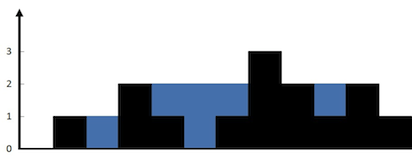

力扣链接:[42. 接雨水](https://leetcode.cn/problems/trapping-rain-water/description/)

> 力扣难度 `困难`

---

给定 `n` 个非负整数表示每个宽度为 1 的柱子的高度图，计算按此排列的柱子，下雨之后能接多少雨水。

## 示例

### 示例 1：



*   **输入：**`height = [0,1,0,2,1,0,1,3,2,1,2,1]`
*   **输出：**`6`
*   **解释：**> 上面是由数组 `[0,1,0,2,1,0,1,3,2,1,2,1]` 表示的高度图，在这种情况下，可以接 6 个单位的雨水（蓝色部分表示雨水）。

### 示例 2：

*   **输入：**`height = [4,2,0,3,2,5]`
*   **输出：**`9`

## 提示：

*   `n == height.length`
*   `1 <= n <= 2 * 10^4`
*   `0 <= height[i] <= 10^5`

---

```go
func trap(height []int) int {
    
}
```

---

```go
func trap(height []int) int {
	ans := 0
	n := len(height)
	prefixMaxNum := make([]int, n)
	suffixMaxNum := make([]int, n)

	prefixMaxNum[0] = height[0]
	for i := 1; i < n; i++ {
		prefixMaxNum[i] = max(height[i], prefixMaxNum[i-1])
	}

	suffixMaxNum[n-1] = height[n-1]
	for i := n - 2; i >= 0; i-- {
		suffixMaxNum[i] = max(height[i], suffixMaxNum[i+1])
	}

	for i := 0; i < n; i++ {
		ans += min(prefixMaxNum[i], suffixMaxNum[i]) - height[i]
	}

	return ans
}
```

```go
func trap(height []int) int {
	ans := 0
	n := len(height)

	left := 0      // 指向最左边
	right := n - 1 // 指向最右边
	pro_max := 0   // 前缀最大值
	suf_max := 0   // 后缀最大值
	for left <= right {
		pro_max = max(pro_max, height[left])
		suf_max = max(suf_max, height[right])
		if pro_max < suf_max {
			ans += pro_max - height[left]
			left++
		} else {
			ans += suf_max - height[right]
			right--
		}
	}

	return ans
}
```
