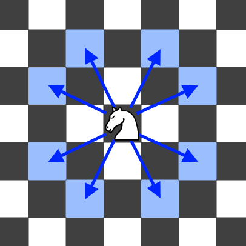

力扣链接:[688. 骑士在棋盘上的概率](https://leetcode.cn/problems/knight-probability-in-chessboard/description/?envType=daily-question&envId=2024-12-07)

力扣难度 `中等`

---
题目:

在一个 `n x n` 的国际象棋棋盘上，一个骑士从单元格 `(row, column)` 开始，并尝试进行 `k` 次移动。行和列是 从 `0` 开始 的，所以左上单元格是 `(0,0)` ，右下单元格是 `(n - 1, n - 1)` 。

象棋骑士有8种可能的走法，如下图所示。每次移动在基本方向上是两个单元格，然后在正交方向上是一个单元格

每次骑士要移动时，它都会随机从8种可能的移动中选择一种(即使棋子会离开棋盘)，然后移动到那里。

骑士继续移动，直到它走了 `k` 步或离开了棋盘。

返回 骑士在棋盘停止移动后仍留在棋盘上的概率 。

---
示例 1：
>输入: n = 3, k = 2, row = 0, column = 0
输出: 0.0625
解释: 有两步(到(1,2)，(2,1))可以让骑士留在棋盘上。
在每一个位置上，也有两种移动可以让骑士留在棋盘上。
骑士留在棋盘上的总概率是0.0625。

示例 2：
>输入: n = 1, k = 0, row = 0, column = 0
输出: 1.00000
---

```go
func knightProbability(n int, k int, row int, column int) float64 {
    
}
```

---



子问题.
在示例 1 中，我们要解决的问题（原问题）是：
马从 (0,0) 出发，走 k=2 步后仍然在棋盘上的概率。
枚举马走的八个方向，假设走到了 (1,2)，问题变成：
马从 (1,2) 出发，走 k−1=1 步后仍然在棋盘上的概率。
这是和原问题相似的、规模更小的子问题，可以用递归解决。



---



### 递归

```go
var dirs = []struct{ x, y int }{{2, 1}, {1, 2}, {-1, 2}, {-2, 1}, {-2, -1}, {-1, -2}, {1, -2}, {2, -1}}

func knightProbability(n int, k int, row int, column int) float64 {
    var dfs func(int, int, int) float64
    dfs = func(k, i, j int) float64 {
        if i < 0 || j < 0 || i >= n || j >= n { // 出界
            return 0
        }
        if k == 0 {
            return 1
        }
        res := 0.0 // 概率
        for _, d := range dirs {
            res += dfs(k-1, i+d.x, j+d.y)
        }
        res /= 8
        return res
    }
    return dfs(k, row, column)
}
```

### 记忆化递归

```go
var dirs = []struct{ x, y int }{{2, 1}, {1, 2}, {-1, 2}, {-2, 1}, {-2, -1}, {-1, -2}, {1, -2}, {2, -1}}

func knightProbability(n int, k int, row int, column int) float64 {
    memo := make([][][]float64, k+1)
    for i := range memo {
        memo[i] = make([][]float64, n)
        for j := range memo[i] {
            memo[i][j] = make([]float64, n)
        }
    }

    var dfs func(int, int, int) float64
    dfs = func(k, i, j int) float64 {
        if i < 0 || j < 0 || i >= n || j >= n { // 出界
            return 0
        }
        if k == 0 {
            return 1
        }
        p := memo[k][i][j]
        if p > 0 {
            return p
        }
        res := 0.0 // 概率
        for _, d := range dirs {
            res += dfs(k-1, i+d.x, j+d.y)
        }
        res /= 8
        memo[k][i][j] = res
        return res
    }
    ans := dfs(k, row, column)
    return ans
}

```

### DP 递归1:1改递推

```go
var dirs = []struct{ x, y int }{{2, 1}, {1, 2}, {-1, 2}, {-2, 1}, {-2, -1}, {-1, -2}, {1, -2}, {2, -1}}

func knightProbability(n, k, row, column int) float64 {
    memo := make([][][]float64, k+1)
    for i := range memo {
        memo[i] = make([][]float64, n)
        for j := range memo[i] {
            memo[i][j] = make([]float64, n)
        }
    }
    var dfs func(int, int, int) float64
    dfs = func(k, i, j int) float64 {
        if i < 0 || j < 0 || i >= n || j >= n {
            return 0
        }
        if k == 0 {
            return 1
        }
        p := &memo[k][i][j]
        if *p > 0 {
            return *p
        }
        res := 0.0
        for _, d := range dirs {
            res += dfs(k-1, i+d.x, j+d.y)
        }
        res /= 8
        *p = res
        return res
    }
    return dfs(k, row, column)
}
```


