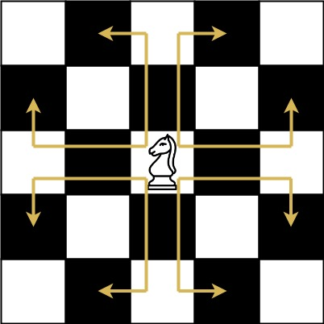
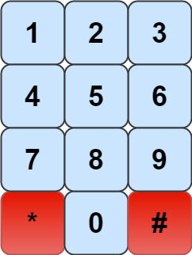
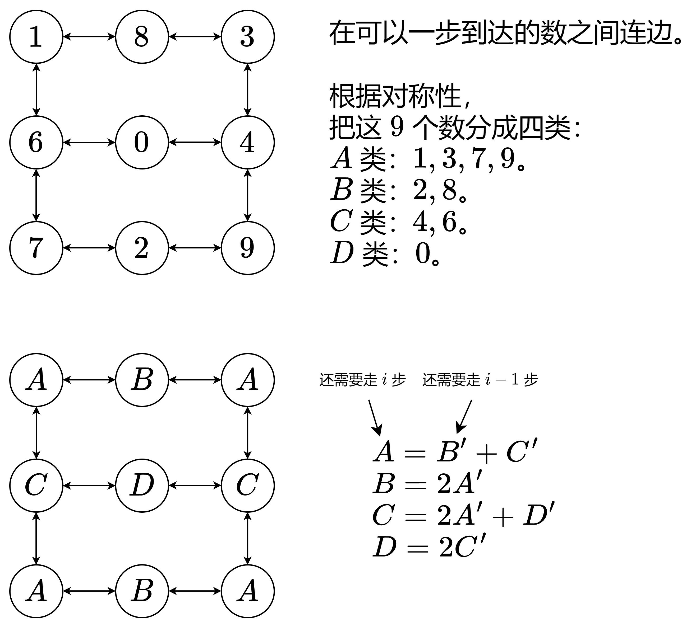

力扣链接:[935. 骑士拨号器](https://leetcode.cn/problems/knight-dialer/description/?envType=daily-question&envId=2024-12-10)

力扣难度 `中等`
算法评级: 5      熟练掌握常用数据结构和算法，初步了解高级数据结构
难度分 1690
---

题目:

象棋骑士有一个独特的移动方式，它可以垂直移动两个方格，水平移动一个方格，或者水平移动两个方格，垂直移动一个方格(两者都形成一个 L 的形状)。

象棋骑士可能的移动方式如下图所示:

我们有一个象棋骑士和一个电话垫，如下所示，骑士只能站在一个数字单元格上(即蓝色单元格)。

给定一个整数 n，返回我们可以拨多少个长度为 n 的不同电话号码。

你可以将骑士放置在任何数字单元格上，然后你应该执行 n - 1 次移动来获得长度为 n 的号码。所有的跳跃应该是有效的骑士跳跃。

因为答案可能很大，所以输出答案模 109 + 7.

---
示例 1：
>输入：n = 1
输出：10
解释：我们需要拨一个长度为1的数字，所以把骑士放在10个单元格中的任何一个数字单元格上都能满足条件。

示例 2：
>输入：n = 2
输出：20
解释：我们可以拨打的所有有效号码为[04, 06, 16, 18, 27, 29, 34, 38, 40, 43, 49, 60, 61, 67, 72, 76, 81, 83, 92, 94]

示例 3：
>输入：n = 3131
输出：136006598
解释：注意取模
---

```go
func knightDialer(n int) int {
    
}
```

---



化成子问题

站在x数字上往y，剩余n
深度遍历就可以解出问题



---



### 暴力递归

```go
var dirs = map[int][]int{
    0: {4, 6},    // 04, 06
    1: {6, 8},    // 16, 18
    2: {7, 9},    // 27, 29
    3: {4, 8},    // 34, 38
    4: {0, 3, 9}, // 40, 43, 49
    6: {0, 1, 7}, // 60, 61, 67
    7: {2, 6},    // 72, 76
    8: {1, 3},    // 81, 83
    9: {2, 4},    // 92, 94
}

func knightDialer(n int) (ans int) {
    mod := 1000000000 + 7
    var dfs func(int, int) int
    dfs = func(y, n int) int {
        if n == 0 {
            return 1
        }
        ans := 0
        for _, v := range dirs[y] {
            ans += dfs(v, n-1)
        }
        return ans % mod
    }
    for i := 0; i < 10; i++ {
        ans += dfs(i, n-1)
    }
    return ans % mod
}
```

### 记忆化递归

```go
var dirs = map[int][]int{
    0: {4, 6},    // 04, 06
    1: {6, 8},    // 16, 18
    2: {7, 9},    // 27, 29
    3: {4, 8},    // 34, 38
    4: {0, 3, 9}, // 40, 43, 49
    6: {0, 1, 7}, // 60, 61, 67
    7: {2, 6},    // 72, 76
    8: {1, 3},    // 81, 83
    9: {2, 4},    // 92, 94
}

func knightDialer(n int) (ans int) {
    mod := 1000000000 + 7
    memo := make([][]int, 10) // memo[y][n]
    for i := 0; i < 10; i++ {
        memo[i] = make([]int, n)
    }
    var dfs func(int, int) int
    dfs = func(y, n int) int {
        if n == 0 {
            return 1
        }
        ans := 0
        for _, v := range dirs[y] {
            if memo[v][n-1] != 0 {
                ans += memo[v][n-1]
            } else {
                ans += dfs(v, n-1)
            }
        }
        ans %= mod
        memo[y][n] = ans
        return ans
    }
    for i := 0; i < 10; i++ {
        ans += dfs(i, n-1)
    }
    return ans % mod
}
```

### 状态定义与状态转移方程（优化后）

将9个数分为4类
A: 1,3,7,9
B: 2,8
C: 4,6
D: 0

分别的状态转移方程
dfs(i,0)=dfs(i−1,1)+dfs(i−1,2)
dfs(i,1)=2⋅dfs(i−1,0)
dfs(i,2)=2⋅dfs(i−1,0)+dfs(i−1,3)
dfs(i,3)=2⋅dfs(i−1,2)

4⋅dfs(n−1,0)+2⋅dfs(n−1,1)+2⋅dfs(n−1,2)+dfs(n−1,3)



```go

```


