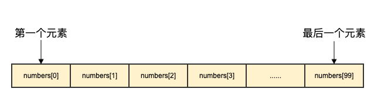

## 底层结构

### array(数组)

Go数组与C数组十分类似，数组是具有相同唯一类型的一组已编号且长度固定的数据项序列

关键字: 相同类型,长度固定，序列



### slice(切片)

```go
type SliceHeader struct {
    Data uintptr // 底层数组的地址
    Len  int     // 长度
    Cap  int     // 容量
}
```

Go 语言切片是对数组的抽象。结构中包含底层数组、长度、容量

## 初始化

### array(数组)

```go
var numbers [5]int // 声明长度为5的数组,数组内容全为默认零值,int的零值为0
var numbers = [5]int{1, 2, 3, 4, 5} // 声明长度为5的数组,数组内容全为{}内的值。 [1 2 3 4 5]
numbers := [5]int{1, 2, 3}// 声明长度为5的数组,数组内容全为{}内的值,少的部分为默认零值。 [1 2 3 0 0]
numbers := [5]int{1, 2, 3, 4, 5, 6}// 由于{}内的值超过了数组超度编译不通过
numbers := [...]int{1, 2, 3, 4, 5, 6}// 如果数组长度不确定，可以使用 ... 代替数组的长度，编译器会根据元素个数自行推断数组的长度
numbers := [...]int{1:1}// 如果数组长度不确定，可以使用 ... 代替数组的长度，编译器会根据元素个数自行推断数组的长度

numbers := [...]int{5: 1, 2, 3, 1: 11}
//  5: 1, 2, 3 表示 在下标5开始 值为1,2,3
//  1: 11 表示 在下标1开始 值为11
//  [0 11 0 0 0 1 2 3]
```

### slice(切片)

```go
s :=[] int {1,2,3} // 声明长度为3,容量为3的切片,内容是[1 2 3]
numbers := []int{5: 1, 2, 3, 1: 11}
//  5: 1, 2, 3 表示 在下标5开始 值为1,2,3
//  1: 11 表示 在下标1开始 值为11
//  [0 11 0 0 0 1 2 3]
```

使用 make() 函数来创建切片

```go
s := make([]T, length, capacity) // T 是类型 length是长度 capacity是容量
s := make([]T, capacity) // T 是类型 capacity是容量和长度

s := make([]int, 3, 4) // 声明长度为3,容量为4的切片,内容是[0 0 0]
s := make([]int, 4) // 声明长度为4,容量为4的切片,内容是[0 0 0 0]
s := make([]int, 4, 3) // 容量小于长度编译不通过
```

## 判断是否相等

### array(数组)

1. 关系运算符 == : 相同长度和类型的数组可以使用 == 对比

```go
[2]int{1, 2} == [2]int{1, 2} // true
[3]int{1, 2} == [2]int{1, 2} // 编译不通过,[3]int与[2]int是不同类型
```

2. 使用reflect(反射)判断是否相等

```go
reflect.DeepEqual([2]int{1, 2}, [2]int{1, 2})
```

### slice(切片)

1. 关系运算符 == : 切片只允许和nil对比

```go
[]int{1, 2} == []int{1, 2} // 编译不通过,切片只允许和nil对比
[]int{} == nil // false,这里判断的是底层数组地址是否为nil

var a []int
a == nil // true,这里a只声明了但是未初始化
```

2. 使用reflect(反射)判断是否相等

```go
reflect.DeepEqual([]int{1, 2}, []int{1, 2, 0})
```

### 扩容

### array(数组)

数组是长度固定,是不允许扩容的

### slice(切片)

slice(切片)可以使用append向后追加元素,如果追加后超过了容量上限会发生扩容

若切片发生扩容时，会开启一个新的数组空间，并将原数组的值拷贝到新数组上

1. 若目标空间大于原空间的2倍，新空间等于目标空间
    - 若目标空间小于1024，新空间等于原空间2倍
    - 若目标空间大于1024，则进入循环，每次循环原空间的大小变为1.25倍。直到装的下
2. 在1.17以后的扩容有变化，目的是更加平滑

### 总结

1. 初始化的区别
    - Slice切片使用make初始化
2. 判断的区别
    - 关系运算符 == : 切片只允许和nil对比
3. 扩容的区别
    - 切片允许扩容
