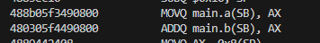
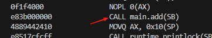

## Go函数类型是否可以比较？

### 比较运算符

在[Go官方文档](https://go.dev/ref/spec#Comparison_operators)比较运算符中有这一段话  

>>Slice, map, and function types are not comparable. However, as a special case, a slice, map, or function value may be compared to the predeclared identifier nil. Comparison of pointer, channel, and interface values to nil is also allowed and follows from the general rules above.  
>
>>切片（Slice）、映射（map）和函数类型是不可比较的。然而，作为一种特殊情况，切片、映射或函数值可以与预先声明的标识符 `nil` 进行比较。指针、通道（channel）和接口值与 `nil` 的比较也是允许的，并且遵循上述一般规则。

因此我们可以看到，Go函数类型之间是不能使用比较运算符的，但是可以和`nil`进行比较。  
例 1:

```go
package main

import "fmt"

func foo() {}

func main() {
    f1 := foo
    f2 := f1
    if f1 == f2 { // 编译错误：invalid operation: f1 == f2 (func can only be compared to nil)
        fmt.Println("函数相等")
    }
}
```

[在线运行](https://go.dev/play/p/-MKUWeDBml7)

例 2:

```go
package main

import "fmt"

func main() {
    var f1 func()
    if f1 == nil { // 函数类型是可以和`nil`进行比较
        fmt.Println("f1 is nil")
    }
}
```

[在线运行](https://go.dev/play/p/QkKEt_KQwUd)

### reflect.DeepEqual

上面是使用比较运算符来进行二者的比较,我们知道在Go中，还可以使用`reflect`包中[`DeepEqual`](https://pkg.go.dev/reflect#DeepEqual)来比较。
> func DeepEqual(x, y any) bool  
功能：判断两个值是否“深度相等”  
>>Func values are deeply equal if both are nil; otherwise they are not deeply equal.
>
>>函数值只有在两者都为 nil 时才深度相等；否则，它们不深度相等。

例 3:

```go
package main

import (
    "fmt"
    "reflect"
)

func foo() {}

func main() {
    f1 := foo
    f2 := f1
    if reflect.DeepEqual(f1, f2) { // 返回 false
        fmt.Println("函数相等")
    }else{
        fmt.Println("函数不相等") // 输出 函数不相等
    }
}
```

[在线运行](https://go.dev/play/p/ta02lmtw1Vf)

我们还能通过`reflect.DeepEqual`的[源码](https://github.com/golang/go/blob/2c1604142324be55a9274bc13a5a143bb3cde809/src/reflect/deepequal.go#L155)

```go
    case Func:
        if v1.IsNil() && v2.IsNil() {
            return true
        }
        // Can't do better than this:
        return false
```

### 总结

Go函数类型之间是不能使用比较,但是可以和`nil`进行比较。

## 为什么？

从上文我们了解到,Go团队在设计Go语言时就限制了函数类型之间对比。但是这样设计是为了什么？

### 猜想一 (编译器内联优化)

```go
package main

var a = func() int { return 1 }()
var b = func() int { return 1 }()

func main() {
    sun := add(a, b)
    print(sun)
}
func add(a, b int) int {
    return a + b
}
```

编译并通过`objdump`工具查看汇编

```text
go build .\main.go
go tool objdump -s main.main .\main.exe
```

```asm
TEXT main.main(SB) C:/Code/Github/Go_T/main.go
  main.go:6             0x469960                493b6610                CMPQ SP, 0x10(R14)  
  main.go:6             0x469964                7635                    JBE 0x46999b        
  main.go:6             0x469966                55                      PUSHQ BP
  main.go:6             0x469967                4889e5                  MOVQ SP, BP
  main.go:6             0x46996a                4883ec10                SUBQ $0x10, SP      
  main.go:7             0x46996e                488b05f3490800          MOVQ main.a(SB), AX 
  main.go:11            0x469975                480305f4490800          ADDQ main.b(SB), AX 
  main.go:11            0x46997c                4889442408              MOVQ AX, 0x8(SP)    
  main.go:8             0x469981                e81a8afcff              CALL runtime.printlock(SB)
  main.go:8             0x469986                488b442408              MOVQ 0x8(SP), AX    
  main.go:8             0x46998b                e8b090fcff              CALL runtime.printint(SB)
  main.go:8             0x469990                e86b8afcff              CALL runtime.printunlock(SB)
  main.go:9             0x469995                4883c410                ADDQ $0x10, SP      
  main.go:9             0x469999                5d                      POPQ BP
  main.go:9             0x46999a                c3                      RET
  main.go:6             0x46999b                0f1f440000              NOPL 0(AX)(AX*1)    
  main.go:6             0x4699a0                e8bb88ffff              CALL runtime.morestack_noctxt.abi0(SB)
  main.go:6             0x4699a5                ebb9                    JMP main.main(SB)   
```

作为对比我们也可以在编译是禁止内联优化

```text
go build -gcflags="all=-l" .\main.go
PS C:\Code\Github\Go_T> go tool objdump -s main.main .\main.exe
```

```asm
  main.go:6             0x470000                493b6610                CMPQ SP, 0x10(R14)
  main.go:6             0x470004                763e                    JBE 0x470044
  main.go:6             0x470006                55                      PUSHQ BP
  main.go:6             0x470007                4889e5                  MOVQ SP, BP
  main.go:6             0x47000a                4883ec18                SUBQ $0x18, SP
  main.go:7             0x47000e                488b1d9bfc0b00          MOVQ main.b(SB), BX
  main.go:7             0x470015                488b058cfc0b00          MOVQ main.a(SB), AX
  main.go:7             0x47001c                0f1f4000                NOPL 0(AX)
  main.go:7             0x470020                e83b000000              CALL main.add(SB)
  main.go:7             0x470025                4889442410              MOVQ AX, 0x10(SP)
  main.go:8             0x47002a                e8517cfcff              CALL runtime.printlock(SB)
  main.go:8             0x47002f                488b442410              MOVQ 0x10(SP), AX
  main.go:8             0x470034                e8e782fcff              CALL runtime.printint(SB)
  main.go:8             0x470039                e8a27cfcff              CALL runtime.printunlock(SB)
  main.go:9             0x47003e                4883c418                ADDQ $0x18, SP
  main.go:9             0x470042                5d                      POPQ BP
  main.go:9             0x470043                c3                      RET
  main.go:6             0x470044                e83786ffff              CALL runtime.morestack_noctxt.abi0(SB)
  main.go:6             0x470049                ebb5                    JMP main.main(SB)
```

#### 编译器内联优化  

  

#### 禁止编译器内联优化  



### 猜想一 总结

我们可以看出编译器内联优化会优化一些代码。add函数会展开内联到main函数中了。
在默认情况下，编译器内联优化导致有些函数调用会被替换为函数体的实际代码。函数都消失了，那就很不用说拿函数之间进行比较。

## 需要函数对比的场景，如何解决？

### 监听者模式

```go
package main

import "fmt"

type Listener func()

var Listeners []Listener

func AddListener(l Listener) {
    Listeners = append(Listeners, l)
}

func CallListeners() {
    for _, l := range Listeners {
        l()
    }
}

func RmListener(l Listener) {
    // TODO 删除监听器
}

func main() {
    AddListener(func() { fmt.Println("Hello") })
    AddListener(func() { fmt.Println("world") })
    CallListeners()
}
```

从上述代码中我们需要为Listener添加一个删除监听器函数。
由于Go中函数不能进行比较。因此下面这种写法是错误的

```go
func RmListener(l Listener) {
    Listeners = slices.DeleteFunc(Listeners, func(x Listener) bool { return x == l })
    // invalid operation: x == l (func can only be compared to nil)compilerUndefinedOp
}
```

#### 解决方案一 使用结构体为函数添加一个可比较的标签

```go
package main

import (
    "fmt"
    "slices"
)

type Tag struct{ *int }
type Listener func()

type taggedListener struct {
    tag      Tag
    listener Listener
}

var Listeners []taggedListener

func AddListener(l Listener) Tag {
    tag := Tag{new(int)}
    Listeners = append(Listeners, taggedListener{tag, l})
    return tag
}

func CallListeners() {
    for _, l := range Listeners {
        l.listener()
    }
}

func RmListener(tag Tag) {
    Listeners = slices.DeleteFunc(Listeners, func(x taggedListener) bool { return x.tag == tag })
}

func main() {
    HelloTag := AddListener(func() { fmt.Println("Hello") })
    AddListener(func() { fmt.Println("world") })
    CallListeners()
    // 删除Hello
    RmListener(HelloTag)
    CallListeners()
}
```
