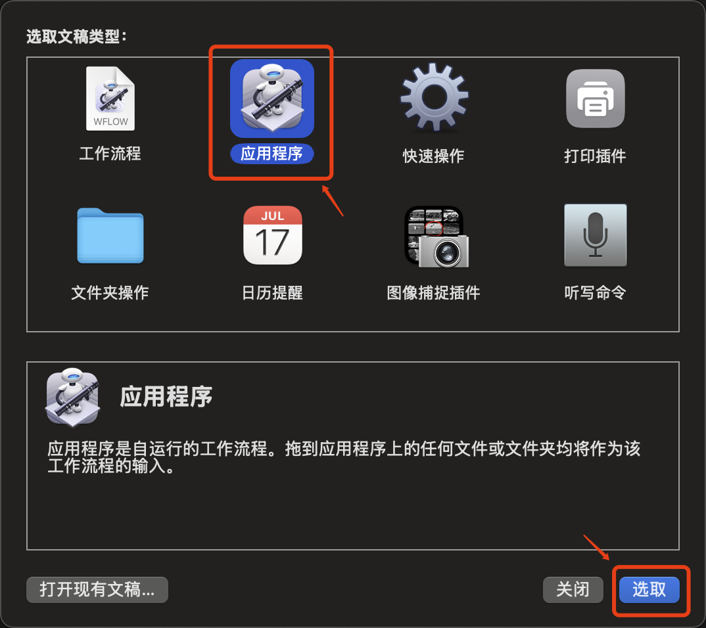
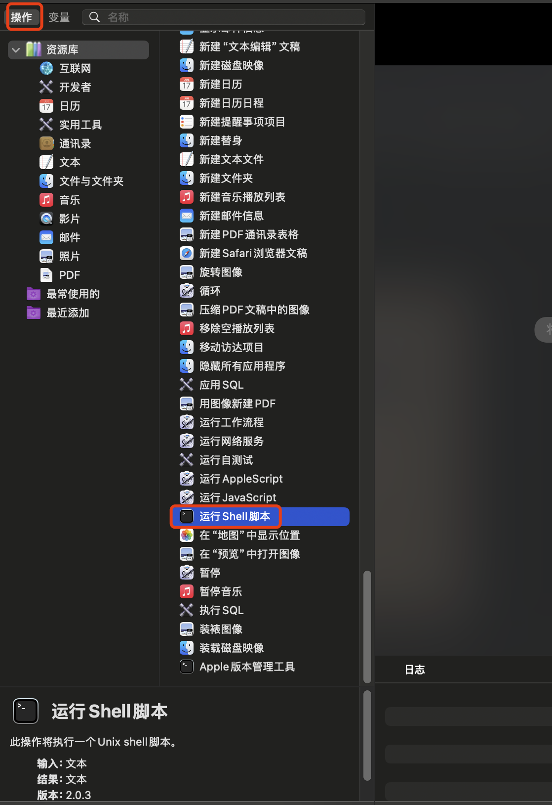
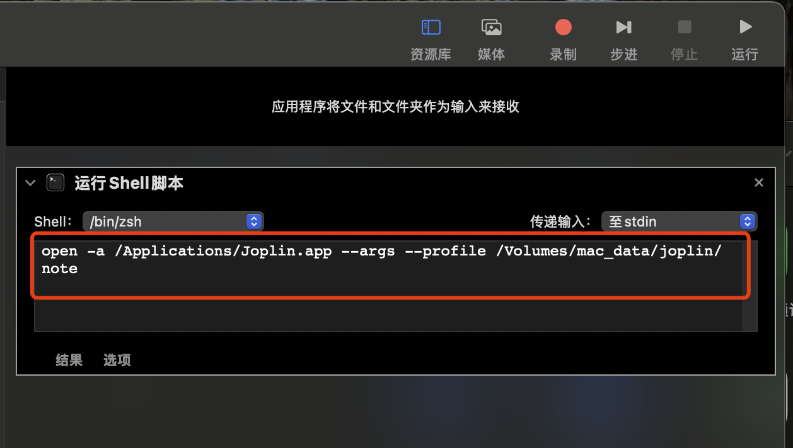
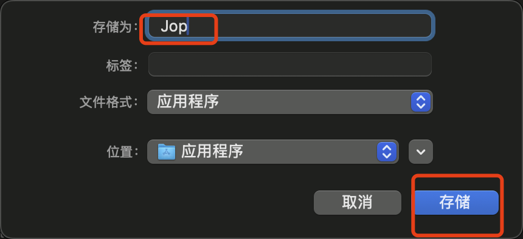
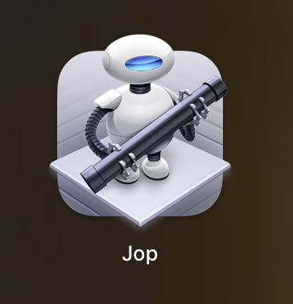
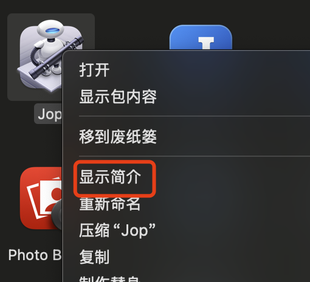
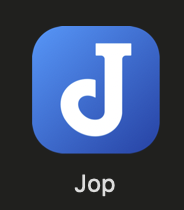

>Joplin 的官方 GUI 并未提供修改存储位置的选项，需要通过启动参数来进行修改。


由于笔者购买的是存储仅为 256GB 的”丐版“” Mac mini，而笔记内容占用的空间较大，因此希望将存储路径更改为 NAS 网络卷。

## 启动命令

```
open -a /Applications/Joplin.app --args --profile /Volumes/mac_data/joplin/note
```
**需要修改的部分：**
- /Applications/Joplin.app：替换为你自己的 Joplin 应用程序路径。
- /Volumes/mac_data/joplin/note：替换为你希望使用的存储路径。

在 Mac 的终端中输入修改后的命令并执行时，你会看到它会尝试启动 Joplin 应用并使用指定的存储路径。

## 创建启动程序

打开Mac自带的`自动操作`程序


选择`应用程序`

在操作中选择`运行Shell脚本`

将启动命令输入右侧输入框

点击左上角存储

修改程序名称并存储到`应用程序`

到这里你将看到`启动台`中多了刚刚保存的应用程序!
点击程序验证一下效果

## 修改启动程序图标

在`访达` -> 应用程序 中找到刚刚创建的`启动程序`
右键 -> 显示简介

将下载的图标拖入替代老的机器人图标



### 下面是Joplin的LOGO

