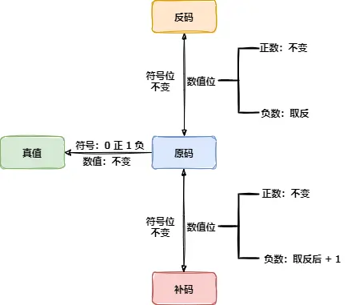

## 名词解释

原码:原码是最简单的整数表示方法，其中最高位用来表示符号（0表示正数，1表示负数），其余位表示数值的绝对值。例如，+5的原码是00000101，-5的原码是10000101。
反码:反码是通过对原码取反得到的，即将正数的原码保持不变，负数的原码的所有位取反（包括符号位）。例如，+5的反码是00000101（与原码相同），-5的反码是11111010。
补码:补码是计算机中最常用的整数表示方法。正数的补码与其原码相同，而负数的补码是其反码加1。补码的特点是在进行加减法运算时，不需要单独处理符号位。例如，+5的补码是00000101，-5的补码是11111011。
移码:移码是一种不常见的整数表示方法，在计算机领域中较少使用。它与补码类似，但是所有的数值都被偏移了一个固定的值，通常是一个中间值，以使得正数的表示始终比负数的表示更大。这种表示方法在某些特殊的硬件设计中可能会使用。


## 例子

1.原码为正数

```text
整数 +1
0000 0001  // 原码
0000 0001  // 反码  // 正数的 反码 = 原码
0000 0001  // 补码  // 正数的 补码 = 反码 = 原码
1000 0001  // 移码  // 移码 = 补码的符号位取反
```

2.原码为0

```text
整数 +0
0000 0000  // 原码
0000 0000  // 反码  // 正数的 反码 = 原码
0000 0000  // 补码  // 正数的 补码 = 反码 = 原码
1000 0000  // 移码  // 移码 = 补码的符号位取反

整数 -0
1000 0000  // 原码
1111 1111  // 反码  // 负数的 反码 = 原码除符号位不变 其他全取反
0000 0000  // 补码  // 负数的 补码 = 反码+1 //这里由于越界,取后8位则结果为8个0
1000 0000  // 移码  // 移码 = 补码的符号位取反
```

3.原码为负数

```text
整数 -1
1000 0001  // 原码
1111 1110  // 反码  // 负数的 反码 = 原码除符号位不变 其他全取反
1111 1111  // 补码  // 负数的 补码 = 反码+1
0110 1111  // 移码  // 移码 = 补码的符号位取反
```

## 应用场景

原码：符合人类直觉，是最简单的整数表示方法

反码：

1.诞生的前景：CPU擅长加法运算，因此为了提高运算速度，会将减法也转为加法 例如 1 - 1 会转为 1 + (-1)  。此时发现计算结果不符合预期

```text
   0000 0001  // 1
+ 1000 0001  // -1
 ——————————————
   1000 0010  // -2
```

2.解决什么问题：解决`原码`运算中，将符号位也参与运算会导致计算结果不符合预期的问题。

```text
   0000 0001  // 1
 + 1111 1110  // -1
 ——————————————
   1111 1111  // -0
```

```text
   0000 0001  // 1
 + 1111 1101  // -2
 ——————————————
   1111 1110  // -1
```

3.还有什么问题：原码和反码都存在+0和-0的问题，计算-0会计算结果不符合预期的问题

```text
   0000 0001  // 1
 + 1111 1111  // -0
 ——————————————
   0000 0000  // +0
```

补码：

1. 诞生的前景：反码解决了大部分的计算问题，但是在连续计算中不可避免会出现-0导致计算结果不符合预期。
2. 解决什么问题：原码和反码中 0的表示不一致，以及导致的运算错误的问题。（-+0）
