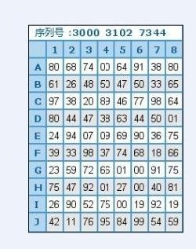
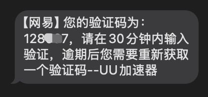

## 双因素身份验证
### 定义

双因素身份验证又译多因子认证、多因素验证、多因素认证，是一种电脑访问控制的方法，用户要通过`两种以上`的认证机制之后，才能得到授权  
2FA（两因素认证，Two-Factor Authentication）主要解决了账户安全性不足的问题。  
简单来说：`不要把鸡蛋放在同一个篮子里`

[维基百科🔗](https://zh.wikipedia.org/zh-cn/%E5%A4%9A%E9%87%8D%E8%A6%81%E7%B4%A0%E9%A9%97%E8%AD%89)

### 2FA的形态演进

#### 🕰️ 1.密保卡

各位年轻时可能都经历过密保卡的时期。用户只需将密保卡绑定到自己的账户，后续登录时，系统会进行 2FA 验证。系统会提示用户：“请输入 X 行 X 列的数字”，从而实现二次验证。

然而，这种方式也存在明显的缺点：如果密保卡被他人拍摄，其安全性就大大降低，因为攻击者可以轻松获取卡片上的验证码。

#### 🕰️ 2.一次性密码（验证码）

**这种动态获取一次性密码的方式在当地使用十分普遍**。用户的账户通常绑定了手机号码或邮箱地址，后续登录时，系统会进行 2FA 验证。系统会将验证码发送到用户的手机或邮箱，用户需要将验证码输入系统，从而完成二次验证。

这种方式很好地解决了密保卡泄漏后的问题，因为攻击者无法轻松获取卡片上的验证码。然而，依然存在一些明显的缺点：

1. **依赖“发码”系统**：用户登录时需要请求验证码系统，这个过程涉及多个环节。例如，短信验证码的流程是：验证码系统 → 消息中心 → 运营商 → 短信 → 用户手机。每增加一个环节，**被中间人攻击的风险就增加**。
   
2. **依赖网络信号**：这种方式完全依赖网络信号和设备的稳定性。如果用户的网络不好或者信号差，可能会收不到验证码，导致登录失败。

3. **接收设备的局限性**：这种方式通常只支持一个接收设备。如果用户绑定的手机不在身边，或者更换了手机号，便无法接收到验证码，造成登录困难。

### 动态令牌的常见算法

动态令牌的核心在于生成一次性密码。目前主流的算法主要有以下几种：

#### 🖊️ 1. OTP (One-Time Password - 一次性密码)

*   **定义：** 这是**一次性密码的总称或概念**，指的是仅在一次会话或交易中有效的密码。它强调的是密码的“一次性”使用属性，用完即作废，以防止密码被重放攻击。
*   **特点：** OTP 本身是一个广泛的概念，**它并不特指某一种具体的生成算法**。像后面要介绍的 HOTP 和 TOTP 都是 OTP 的具体实现方式。

#### 🖊️ 2. HOTP (HMAC-based One-Time Password - 基于 HMAC 的一次性密码)

*   **定义：** (RFC 4226) 这是一种**基于事件计数器**的 OTP 算法。
*   **工作原理：** 它使用一个共享密钥（只有用户和服务端知道）和一个**递增的计数器**作为输入，通过 HMAC（哈希消息认证码）算法生成一次性密码。
*   **特点：**
    *   **事件驱动：** 密码的生成依赖于计数器的值。每生成或成功验证一次密码，计数器就加 1。
    *   **同步关键：** 用户端（如硬件令牌或软件应用）和服务端必须保持计数器的同步。如果两边计数器偏差过大，验证就会失败。
    *   **非时间相关：** 密码本身不会随时间自动变化，只有在请求生成新密码时（计数器增加）才会改变。

#### 🖊️ 3. TOTP (Time-based One-Time Password - 基于时间的一次性密码)

*   **定义：** (RFC 6238) 这是目前**最广泛使用**的一种 OTP 算法，是 HOTP 的一种变体和改进。我们前面提到的 Google Authenticator 等应用主要使用的就是这种算法。
*   **工作原理：** 它同样使用共享密钥，但**将当前时间（通常以 30 秒或 60 秒为一个时间步长）** 作为动态变化输入，通过 HMAC 算法生成一次性密码。
*   **特点：**
    *   **时间驱动：** 密码每隔一个固定的时间窗口（如 30 秒）就会自动更新，无需用户操作或事件触发。
    *   **无需计数器同步：** 它解决了 HOTP 的计数器同步问题，只需要用户设备和服务端的时钟大致同步即可（允许一定的误差）。
    *   **广泛应用：** 由于其便利性和解决了同步难题，TOTP 成为了软件令牌（如手机 App）和许多在线服务 2FA 的事实标准。

**总结：** OTP 是总称。HOTP 是基于事件计数器的实现，需要同步计数器。TOTP 是基于时间的实现，是 HOTP 的改进，只需要大致同步时钟，是当前最主流的动态密码算法。

### 代码演示

#### 🖊️ 1. HOTP 参考 [RFC4226](https://datatracker.ietf.org/doc/html/rfc4226)

#### 🖊️ 2. TOTP 参考 [RFC6238](https://datatracker.ietf.org/doc/html/rfc6238)