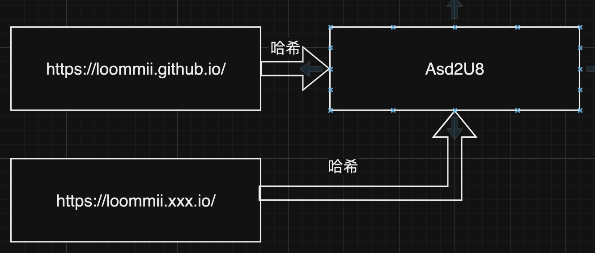

### 什么是URL短链服务

URL短链服务的本质是通过HTTP 302重定向机制，将一个简短的URL重定向到原始的长URL。

### 短链服务解决了什么问题

1. 解决消息发送的字数限制问题
例如，腾讯云SMS限制每条短信的字数为500个字符，而在营销短信中，通常会携带包含大量参数的URL（如邀请平台、邀请人、活动ID等）。这些参数使得URL变得非常冗长。通过URL短链服务，营销短信中的长URL可以被替换为一个简短的短链，节省了字数空间。

2. 隐藏请求参数
以营销活动为例，URL中的常见参数可能包括活动ID等信息。如果我们不希望这些ID被随便修改，可以在参数中添加对应的活动ID KEY，这样只有当ID和KEY匹配时，用户才能进入相应的活动页面。然而，添加了KEY后，原本的URL会变得更加冗长。短链服务可以帮助隐藏这些请求参数，保持URL简洁且安全。

### 最基础的需求

1. 长链登记
2. 短链重定向

### 短链KEY为什么选择 Base62 编码

根据 RFC3986 标准，URL 由 ASCII 字符组成，以下字符可以安全地在 URL 中使用：

- 字母（a-z 和 A-Z）
- 数字（0-9）
- 部分特殊字符：$-_.+!*'(),
虽然RFC3986标准允许一些特殊字符，但有些特殊字符可能会对URL解析、传输或存储造成问题。例如，字符如 &, ?, =, # 等在查询参数或路径中有特定意义，因此它们可能引起冲突或产生解析错误。

> 为了避免这些潜在的麻烦，特别是在需要将复杂的查询参数或密钥编码为 URL 友好的格式时，我们通常会选择 Base62 编码，即只使用字母（大小写）和数字的组合。
>
### 短链KEY的长度选择

我们字符集已经确定为Base62,因此长度为1 可以存储 62种。每增加一位，存储的极限数量会按 62 的指数增长。

|长度|存储极限|解释
|:--|:--|:--|
|1| 62|1 位可以表示 62 种不同的组合|
|2|62 × 62 = 3,844    |2 位可以表示 62 的平方，即 3,844 种不同的组合
|3|62 × 62 × 62 = 238,328    |3 位可以表示 62 的三次方，即 238,328 种不同的组合
|4|62 × 62 × 62 × 62 = 14,776,336    |4 位可以表示 62 的四次方，即 14,776,336 种不同的组合
|5|62 × 62 × 62 × 62 × 62 = 916,132,832    |5 位可以表示 62 的五次方，即 916,132,832种不同的组合
|6|62 × 62 × 62 × 62 × 62 × 62 = 56,800,235,584    |6 位可以表示 62 的六次方，即 56,800,235,584 种不同的组合

>5位的存储极限已经达到916,132,832,这个数量已经非常大，足以支持大多数应用场景。然而，如果你希望进一步减少生成字符时的冲突、长远规划，选择 6 位 作为短链 KEY 长度会是一个不错的选择。

### 短链KEY的生成

没有最好的方案只有最适合的方案

#### 方案一:随机生成短链 KEY

实现:系统通过随机函数生成对应短链 KEY
优点：

- 实现容易：随机生成短链 KEY 的实现相对简单，可以通过生成随机数并映射到 Base62 字符集，快速获得短链标识符。大多数编程语言都提供了简单的随机数生成函数，操作简便。

缺点：

- 冲突的概率随着存量数据增多而增加
- 相同的长URL会生成不同的短链 KEY，可能导致浪费

解决：采用哈希计算，

#### 方案二:哈希计算

实现:将长 URL 通过哈希算法生成固定长度的短链 KEY。

优点：

- 解决了相同的长 URL 会生成不同的短链的问题：哈希计算能够确保相同的长 URL 每次生成相同的短链 KEY，从而避免存储冗余。

缺点：

- 哈希冲突的可能性：虽然哈希函数可以生成固定长度的短链，但不同的长 URL 可能会产生相同的哈希值，从而发生哈希冲突。

解决:遇到哈希冲突时，可以在哈希值后插入无意义的字符串或采用其他去重策略，如进行二次哈希计算。

#### 方案三:计数器自增法 + 字典

实现: 通过维护一个计数器，每当新增一个长 URL 时，计数器自增，然后将计数值转为固定的短链 KEY。
> 例: 值为66 短链 KEY为 字典[0]+字典[0]+字典[0]+字典[0]+字典[1]+字典[4]

优点：

- 单机环境下不存在冲突的可能：由于计数器是自增的，每个短链 KEY 都是唯一的，因此不会发生冲突。

缺点:

- 生成的短链 KEY 存在明显的规律：由于短链 KEY 基于计数器生成，因此 KEY 存在明显的递增规律，易被推测或猜测。
- 分布式环境下，存在冲突的可能：在分布式环境中，如果多个节点使用相同的计数器，可能会导致短链 KEY 冲突。
- 相同的长 URL 会生成不同的短链 KEY，可能导致浪费：每次生成短链时，相同的长 URL 会得到不同的短链 KEY。

解决: 可以通过计数倒置、乱序字典、哈希计算等方式来优化生成逻辑，减少规律性和冲突。

#### 方案四:计数器自增法 + 乱序字典 + 计数倒置 +哈希计算

实现：

- 乱序字典：在服务启动时，打乱字典的顺序，确保相同的计数值生成不同的短链 KEY，从而避免分布式环境下的冲突。
- 计数倒置：为了打破短链生成中的规律性，可以在计数器自增的基础上对生成的数字进行倒置处理，使每次数字变化幅度增大，生成的短链 KEY 更加多样化。

> 例如 123 -> 00 0000 0123 -> 32 1000 0000

优点：

- 几乎解决了所有问题：这种方案通过多种方式的优化，几乎解决了所有潜在问题，如冲突、规律性、浪费等。

缺点:

- 服务实现相对复杂：该方案需要额外的逻辑来处理字典乱序、计数倒置等，服务实现较为复杂。
- 性能要求较高
