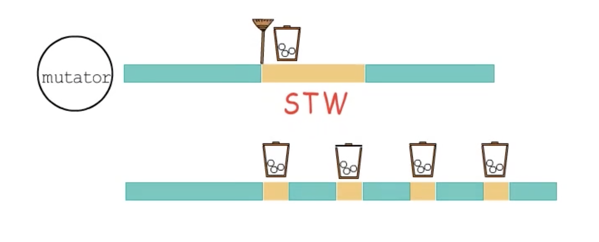
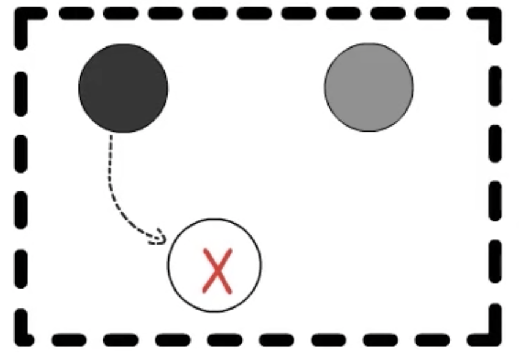
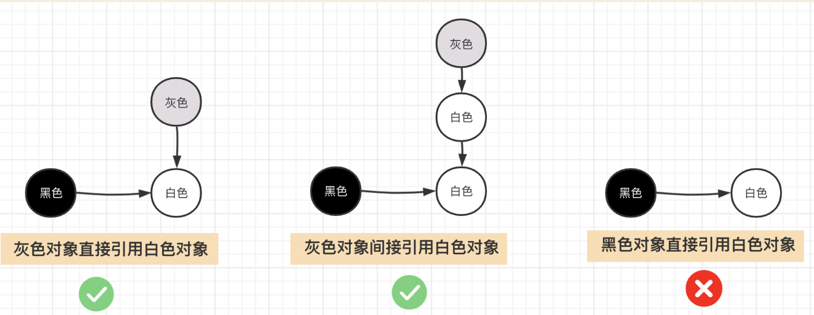
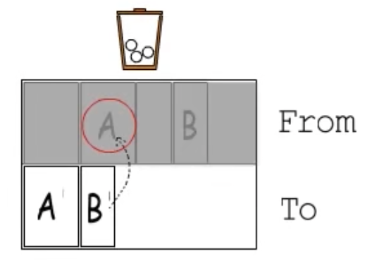
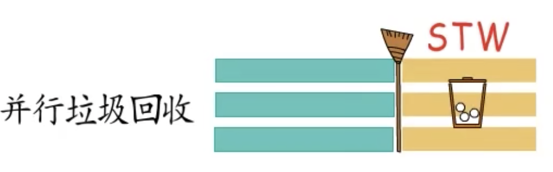
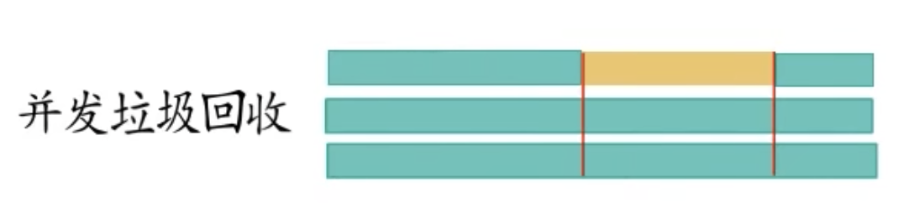
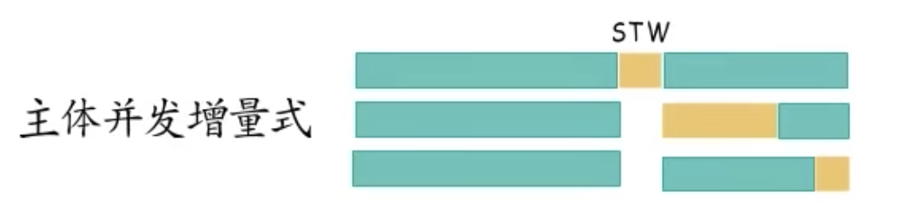

## 垃圾回收

1. 垃圾回收这里的垃圾指的是什么？为什么要回收？
在程序运行的时候，进程会在堆内存申请内存空间。但是在函数退出的时候会栈空间会被销毁。因此这一段堆内存空间没有任何的指针指向它（没有被引用）。因此会造成内存的浪费（内存泄露）。这一段的没有被引用的内存就是“垃圾”。，程序员不再需要手动管理内存的分配和释放，从而减少了由于内存管理不当引起的内存泄漏或悬空指针等问题。

2. 常见的GC有哪几种
     - 手动垃圾回收，代表语言（C，C++）
     - 标记-清扫算法
         - 三色标记法
     - 标记-整理算法
         - 移动整理法
         - 复制整理法
     - 分代回收
     - 引用计数
3. 简述常见的GC如何实现，和他们各自的优缺点。
    - 手动垃圾回收：
        - 实现：程序员自行调用函数销毁
        - 优点：程序员对程序内存的掌控自由。
        - 缺点：容易出现提前释放（悬挂指针）、忘记释放（内存泄漏)等问题。
    - 标记-清扫算法：
        - 实现：标记从根节点（栈内存、数据段）能追踪到的数据为游泳数据，其他未标记的数据就是垃圾数据，将对垃圾数据进行回收
        - 优点：实现相对简单，
        - 缺点：容易造成内存碎片化
    - 标记-整理算法：
        - 实现：
            - 标记阶段与`标记-清扫算法`一致。
            - 整理阶段：
                - 移动整理法：整理移动有用的数据，使有用的数据尽可能紧凑的放在内存里。
                    - 优点：解决了内存碎片化的问题
                    - 缺点：多次扫描移动，会带来不小的性能开销
                - 复制整理法：将内存划分为Form和To，将From空间中的有用数据都复制到To空间。并将Form和To空间的角色对换。
                    - 优点：解决了多次扫描移动的性能问题
                    - 缺点：内存使用率低。只有一半的堆内存空间被使用
    - 分代回收：
        - 实现：基于`弱分代假说`。将数据分为新生代、老年代。新生代、老年代采用不同的回收算法
    - 引用计数
        - 实现：每次对象应用都会更新对象的引用计数，当引用计数为0就回收该空间
        - 优点：可以及时回收垃圾内存
        - 缺点：高频更新引用计数会有不小性能开销，循环引用会导致引用计数永远不为0

4. 什么是STW，为什么会有STW。
    STW（stop the world）简单的就是让用户程序停下来。
    
    STW期间，程序会进行垃圾回收

## STW

    STW 是 Stop-The-World 的缩写，指的是在垃圾回收或某些系统操作过程中，暂停所有应用程序线程的行为，直到特定任务（通常是垃圾回收）完成。
![e6d686db23ff699d03219905d8ceb2c1.png].(/e6d686db23ff699d03219905d8ceb2c1.png)
这里会带来一个问题，用户程序接受长时间STW吗？
为了解决这个问题就出现了`增量式垃圾回收`

## 增量式垃圾回收

实现：将一次GC分为多次，并和用户程序交互进行
优点：解决了STW时间长的问题
缺点：如果在标记后-清理前。创建的内容将会被误删除

为了避免误删可以采用`三色抽象`避免
三色抽象:标记数据分为 黑 - 灰 - 白

- 黑：已经遍历标记完的数据
- 灰：还未遍历完的数据
- 白：未遍历（应用不到）的垃圾数据

因此在清扫阶段发现有黑->白的数据。着这个白数据是在标记后-清理前创建的

因此Golang官方提出2种条件

- 强三色不变式：不允许出现黑色到白色的情况

- 弱三色不变式：允许黑色到白色的情况，但是这个白色需要被灰色引用

写屏障

- 插入写屏障
  - 满足`强三色不变式`条件（关注白色对象的写入操作）
    - 在增量式垃圾回收中,若出现白色对象指向黑色则将白色改为灰色，或者把黑色改为灰色。
    - 例子：Gc和用户代码交替的期间，如果new了一段新的空间，（黑->白）。则这个new的新空间直接标记为灰。（黑->灰）或将黑改为灰（灰->白）
- 删除写屏障
  - 满足`弱三色不变式`条件 （关注对白色对象路径破坏行为）
    - 在增量式垃圾回收中,若出现删除灰色->白色的引用时，则将白色改为灰色
    - 例子：Gc和用户代码交替的期间，若有个灰色对象 -> 白色对象，程序将灰色对象 = nil。着需要将白色对象改为灰色

读屏障
    解决标记-复制GC里面，在复制过程中。回收器将From改为To的过程中。如果要读取From要检查一下To区里面是不是已经复制了。如果复制过来就去都去To
    

## 多核情况

- 并行垃圾回收
  - 
  - 注意同步问题
- 并发垃圾回收
  - 
  - 解决同步问题,但是需要注意通知开启读写屏障的问题
- 主体并发式垃圾回收
  - 
  - 解决通知开启读写屏障的问题时间不一致的问题
- 主体并发增量式垃圾回收
  - 

## GO语言的GC

- 采用标记-清扫算法
  - 标记阶段使用三色标记法
- 主体并发增量式垃圾回收
- 使用插入与删除写屏障结合的混合写屏障
