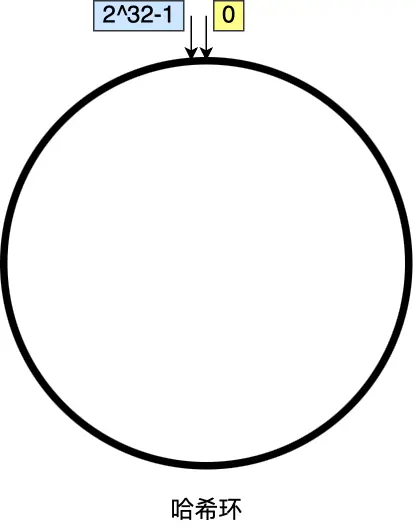
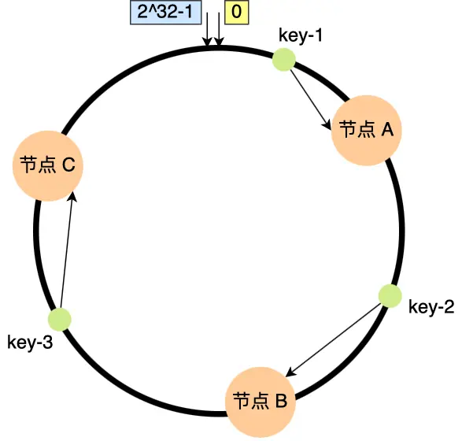
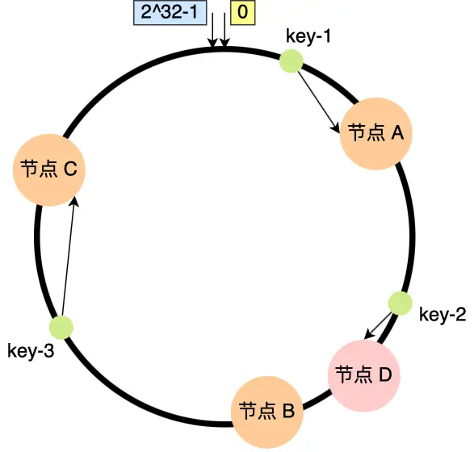
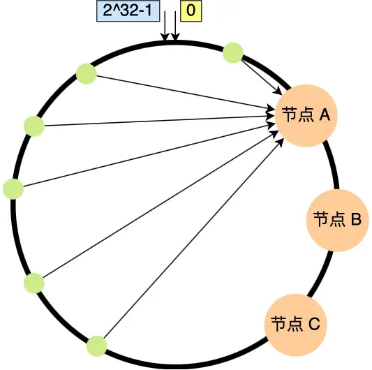
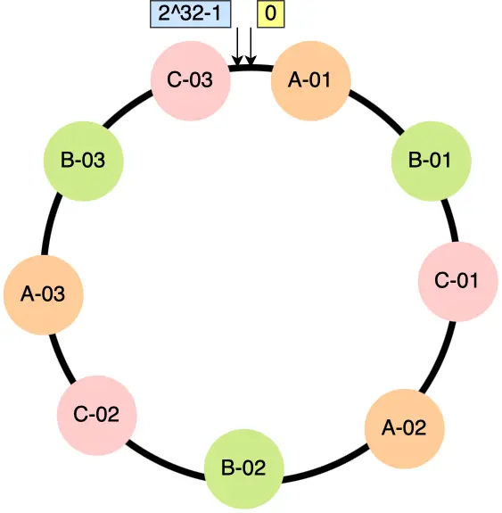

**问题分析：**

1.  **数据过多导致树高增加**
    MySQL 的默认存储引擎 InnoDB 采用了 B+树的数据结构。3 层树大概能存储 2KW 行数据量，超过了这个数会导致 3 层树变为 4 层树，增加了一次硬盘 IO 读取导致 SQL 变慢。
2.  **并发连接数不够**
    MySQL 的默认最大连接数是 151，可以在 `/etc/my.conf` 更改。具体可以看文档 `max_connections` 参数。
    超过连接数会出现 `too many connections` 报错。

**解决方案：**

**分库分表：**
将数据按照某个维度水平的切割。

### range 范围

例如：
*   用户 ID \[0, 500W) 放库 1 表 1
*   用户 ID \[500W, 1000W) 放库 2 表 2

👆这样会导致例外一个问题。
> 你会发现用户 ID 小的老用户很多都不上线了，用户 ID 新的用户还是很多，依旧导致了库 2 的连接数还是超了。

因此不能这么简单的通过 ID 的大小去分库分表。
这时候就可以引入了哈希（hash）。

### 哈希（hash）

哈希的方式可以使得用户 ID 分散到多个库、表上。
```go
if hash(用户ID)%2 == 0 {
	 放库1 表1
} else if hash(用户ID)%2 == 1 {
	放库2 表2
}
```
👆这样会导致例外一个问题。
> 我们取模是按照库、表的总量去分的，我们目前就分了 2 个，如果有一天用户的数据已经多到需要增加新的表。公式就变为了 `hash(用户ID)%3` 导致查到错的表上。这时候需要将历史数据（全量）的表数据迁移到 `hash(用户ID)%3` 后的表上。代价过高。

这时候就可以引入一致性哈希。

### 一致性哈希

我们将哈希中 `%(主机总数)` 改为 `%(2^32)`，
这样用户 ID 将会是 \[0, 2^32] 中的一个点。


这时候我们将节点（表）也一样扔进哈希中。
`hash(用户ID)%(2^32)`
`hash(节点ID)%(2^32)`

然后从用户哈希后的值出发找最近的节点。


如果遇到了哈希中 增加节点的问题。

例如上图增加 D，我们只需要将 B 节点迁移到 D 节点上就可以了。
相比普通的哈希算法，一致性哈希在节点数量变更导致的数据迁移代价更小。

👆这样可以会导致例外一个问题。
> 如果节点过少，大量的数据可能只会访问一个节点。


这时候就可以引入虚拟节点。

### 一致性哈希+虚拟节点

将节点的添加几个别名。
例如
节点 A1 、节点 A2、节点 A3 背后的实际节点都是节点 A。

可以的话，可以使得在哈希环上的节点分散更加合理。
