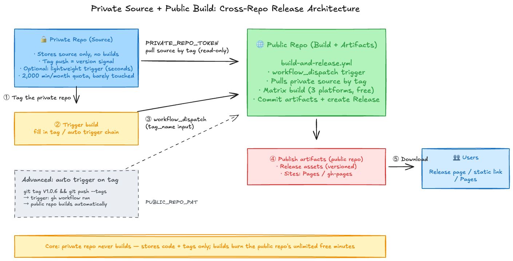

# Dual-Repo Auto Release: Private Repo Stores Code, Public Repo Builds


## Background

For some projects, we want to **keep the source private** while making the **build artifacts public**:

- The source contains core logic, configuration, and protocol implementations — core assets that must stay confidential
- The compiled artifacts (firmware `.bin`, static sites, installers, etc.) must be publicly downloadable or accessible

A single repo can't do both: making everything public exposes the source; making everything private locks users out of the artifacts — and your builds are still throttled by the private repo's quota.

The **dual-repo architecture** is designed exactly for this problem:

- **Private repo**: only stores source, configuration, and build configuration — it never builds
- **Public repo**: handles the build and hosts the artifacts, serving users

## Core Idea: Private Repo Stores Code Only, Public Repo Builds

The dual-repo architecture faces a hard constraint: **GitHub Actions grants private repos only 2,000 free minutes per month** (Free plan), while **public repo Actions minutes are completely free and unlimited** — even for the high-priced macOS / Windows runners.

> Source: [GitHub Actions billing docs](https://docs.github.com/en/billing/concepts/product-billing/github-actions)

Building is precisely the most time-consuming part — an ESP-IDF container build can take 10–60 minutes, and adding a three-platform Tauri desktop matrix, one full release can easily take tens of minutes (billed per job, rounded up). The private repo's 2,000-minute monthly quota can't survive many releases.

So the **key design** of this architecture is:

> **The private repo never builds.** It only stores source code; the build workflow lives entirely in the **public repo**, which pulls the private source and builds it — consuming the public repo's free unlimited minutes.

The pipeline in one sentence:

**Private repo stores code and tags a version → public repo's workflow pulls the private source at that tag → builds in the public repo → artifacts are published to the public repo (Release / Pages)**

## Architecture Overview



## Design Decision: Why Build in the Public Repo?

| | Public repo | Private repo |
|---|---|---|
| **GitHub-hosted runner minutes** | Unlimited (free) | 2,000 minutes/month (Free plan) |
| **Artifact / Cache storage** | Free tier includes artifact/cache allowance (see official docs for current limits) | 1 GB (Free plan) |
| **macOS / Windows runners** | Also free | Counted against 2,000 min at 10x/2x rates |

> Source: [GitHub Actions billing docs](https://docs.github.com/en/billing/concepts/product-billing/github-actions) · [Community discussion](https://github.com/orgs/community/discussions/26054)

With the build running in the public repo, it burns the public repo's free unlimited quota. Take my firmware project as an example: one full "firmware + three-platform desktop client" build takes about 9–10 minutes — **zero cost** on the public repo. The same matrix on the private repo, with macOS billed at a 10x multiplier, would consume 100+ minutes of quota per release.

The public repo can pull the private source via a Personal Access Token — the workflow runs on the public repo's Actions runner, the private source exists only briefly on the runner during the build, and is recycled with the runner afterwards. It never enters the public repo's Git history.

## Prerequisites

1. A private repo: stores the source; the project builds locally
2. A public repo: hosts the workflow and the artifacts
3. Basic understanding of Fine-grained Personal Access Tokens (classic PATs can't scope to a single repo with a single permission, which is why we use Fine-grained)

## Step 1: Prepare a GitHub Personal Access Token

The public repo's workflow needs a token to pull your private source.

### 1.1 Open the token page

Visit: https://github.com/settings/tokens?type=beta

### 1.2 Configure the token

| Field | Value |
|------|---------|
| **Token name** | `PRIVATE_REPO_TOKEN` (any name) |
| **Expiration** | 90 days recommended |
| **Repository access** | **Only your private repo** (least privilege) |
| **Permissions** | **Contents** → **Read-only** |

### 1.3 Save the token

**Copy and store it immediately** (it cannot be viewed again after leaving the page), then add it to the **public repo**:

1. Go to the public repo's **Settings** → **Secrets and variables** → **Actions**
2. Click **New repository secret**
3. Name: `PRIVATE_REPO_TOKEN`
4. Value: paste the token

The private repo needs **no configuration at all** — it is passively pulled.

## Step 2: Create the Build Workflow in the Public Repo

Create `.github/workflows/build-and-release.yml` in the **public repo**. Taking my firmware project as an example: the private repo holds the firmware + desktop client source; the public repo is triggered manually with a tag input, pulls the source, builds with a matrix, and publishes a Release in the current repo (replace repo names with your own):

```yaml
name: Build and Release Firmware + Desktop

# Manual trigger: fill in the tag to build from the private repo
on:
  workflow_dispatch:
    inputs:
      tag_name:
        description: Tag to build from the private repo (e.g. V1.0.6)
        required: true
        default: V1.0.6

concurrency:
  group: manual-build-${{ inputs.tag_name }}
  cancel-in-progress: true

jobs:
  # ── Firmware build (ESP-IDF container) ──
  build-firmware:
    runs-on: ubuntu-latest
    container: espressif/idf:v6.0.1
    steps:
      - name: Pull private repo source
        uses: actions/checkout@v4
        with:
          repository: loommii/esp32-usb-hid-device      # your private repo
          token: ${{ secrets.PRIVATE_REPO_TOKEN }}
          ref: ${{ inputs.tag_name }}      # pull source at the tag

      - name: Build and merge single-file firmware
        run: |
          . /opt/esp/idf/export.sh
          idf.py set-target esp32s3
          mkdir -p "$(pwd)/firmware"
          idf.py merge-bin -o "$(pwd)/firmware/firmware.bin" -f raw

      - uses: actions/upload-artifact@v4
        with:
          name: firmware-bin
          path: firmware/firmware.bin

  # ── Desktop client build (matrix, Tauri example — replace with your build) ──
  build-desktop:
    strategy:
      matrix:
        include:
          - platform: macos-latest
          - platform: windows-latest
          - platform: ubuntu-22.04
    runs-on: ${{ matrix.platform }}
    steps:
      - name: Pull private repo source
        uses: actions/checkout@v4
        with:
          repository: loommii/esp32-usb-hid-device      # your private repo
          token: ${{ secrets.PRIVATE_REPO_TOKEN }}
          ref: ${{ github.event.inputs.tag_name }}

      # ... your build steps; upload artifacts with upload-artifact
      - uses: actions/upload-artifact@v4
        with:
          name: desktop-${{ matrix.platform }}
          path: |
            **/*.dmg
            **/*.exe
            **/*.msi
            **/*.deb
            **/*.AppImage
          if-no-files-found: error

  # ── Release: create a Release in the public repo ──
  release:
    runs-on: ubuntu-latest
    needs: [build-firmware, build-desktop]
    permissions:
      contents: write
    steps:
      - uses: actions/checkout@v4

      - uses: actions/download-artifact@v4
        with:
          path: artifacts

      - name: Create Release in this repo
        env:
          GH_TOKEN: ${{ secrets.GITHUB_TOKEN }}
        run: |
          set -euo pipefail
          TAG="${{ inputs.tag_name }}"

          # Delete old Release first for idempotent re-runs
          gh release delete "${TAG}" --yes 2>/dev/null || true
          gh release create "${TAG}" \
            --verify-tag \
            --title "Release ${TAG}" \
            --notes "Release ${TAG}"

      - name: Upload all artifacts to the Release
        env:
          GH_TOKEN: ${{ secrets.GITHUB_TOKEN }}
        run: |
          set -euo pipefail
          TAG="${{ github.event.inputs.tag_name }}"
          find artifacts -type f | while read -r f; do
            gh release upload "${TAG}" "${f}" --clobber
          done
```

Key points:

- **`workflow_dispatch` + `tag_name` input**: click Run workflow in the public repo's Actions page and fill in the private repo's tag
- **`ref: ${{ github.event.inputs.tag_name }}`**: the checkout targets not the public repo itself, but the **private repo at the given tag** — the version is fully determined by the tag
- **Three-platform matrix**: macOS / Windows / Linux runners are all free on public repos — matrix builds like Tauri can run without worry
- **`concurrency` cancels stale runs**: re-triggering the same tag cancels queued old runs
- **Idempotent publishing**: `gh release delete` before `create`, so re-runs never fail

After the build, artifacts appear as Release assets in the public repo for users to download. For website projects, replace the Release section with a push to the `gh-pages` branch or a GitHub Pages deployment.

## Step 3: Release a Version

The private repo side is just the normal development flow:

```bash
# In the private repo
git tag V1.0.6
git push origin V1.0.6
```

Then go to **public repo → Actions → Build and Release → Run workflow**, and fill in the tag:

```
tag_name: V1.0.6
```

Click run. Everything after that is automatic: the public repo pulls the private source at `V1.0.6` → matrix build → Release. The whole run takes about 10 minutes and burns the public repo's free quota.

## Advanced: Auto Trigger on Tag

The flow above needs one manual click. To achieve "tag the private repo → public repo builds automatically", add a **lightweight trigger** to the private repo — it makes a single API call and finishes in seconds, placing almost no burden on the private quota.

### Create the trigger in the private repo: `.github/workflows/trigger-build.yml`

```yaml
name: Trigger Public Build

on:
  push:
    tags:
      - 'V*'  # matches V1.0.6, V3.0.0, etc.
  workflow_dispatch:

permissions:
  contents: read

jobs:
  trigger:
    runs-on: ubuntu-latest
    steps:
      - name: Trigger public repo workflow
        env:
          GH_TOKEN: ${{ secrets.PUBLIC_REPO_PAT }}
        run: |
          VERSION="${GITHUB_REF_NAME}"

          echo "Triggering public build: ${VERSION}"

          # Call the GitHub API to remotely dispatch the public repo's workflow
          gh workflow run build-and-release.yml \
            --repo loommii/esp32-usb-hid-device-releases \
            --ref main \
            -f tag_name="${VERSION}"

          echo "✅ Public build triggered"
```

### Configure the trigger token

Generate a Fine-grained PAT:

- **Repository access**: only the public repo
- **Permissions**: **Actions** → **Read and write** (to trigger `workflow_dispatch` on the public repo you need `Actions: write`; if you use the `repository_dispatch` event mentioned at the end instead, the required permission is `Contents: Read and write` — don't mix them up)

Add a Secret to the **private repo**: Name `PUBLIC_REPO_PAT`, value the token.

The release flow then collapses to one command:

```bash
git tag V1.0.6 && git push origin V1.0.6
```

The private trigger detects the tag (seconds) → remotely dispatches the public workflow → the public repo pulls the private source at that tag → builds → Release. You can also use the `repository_dispatch` event for the same effect (add `repository_dispatch` to the public workflow's `on:`, and call `gh api repos/<owner>/<public-repo>/dispatches` from the trigger) — they are equivalent; pick whichever you prefer.

## Adapting to Other Projects

This pattern is project-agnostic — only the **build steps** and **publishing method** in the workflow change:

### ESP-IDF firmware

```yaml
jobs:
  build-firmware:
    runs-on: ubuntu-latest
    container: espressif/idf:v6.0.1  # ← key: the ESP-IDF container
    steps:
      # ... checkout private repo same as the main example
      - name: Build
        run: |
          . /opt/esp/idf/export.sh
          idf.py set-target esp32s3
          idf.py merge-bin -o firmware.bin -f raw
```

### PlatformIO firmware

```yaml
steps:
  # ... checkout private repo same as the main example
  - uses: actions/setup-python@v5
    with:
      python-version: '3.11'
  - run: pip install platformio
  - run: pio run      # artifact: .pio/build/<env>/firmware.bin
```

### Hugo blog

```yaml
steps:
  # ... checkout private repo same as the main example
  - uses: peaceiris/actions-hugo@v3
    with:
      hugo-version: '0.165.0'
      extended: true
  - run: hugo --minify
  # artifact: public/ → push to gh-pages or deploy to Pages
```

I use this exact pattern to maintain both an embedded firmware release pipeline (private source repo → public Releases repo, with a three-platform desktop matrix) and this blog's deployment (private Hugo source → public GitHub Pages repo) — the same pipeline, only the build steps and artifact publishing differ.

## Security Considerations

1. **Least privilege, separated token purposes**:
   - `PRIVATE_REPO_TOKEN` (stored in the public repo): private repo only, `Contents` → `Read-only`
   - `PUBLIC_REPO_PAT` (stored in the private repo, only needed for the advanced auto trigger): public repo only, `Actions` → `Read and write`
2. **Scope Repository access to specific repos**, never "All repositories"
3. **Token expiration**: 90 days recommended, rotate regularly
4. **Secrets protection**: tokens live in GitHub Secrets and never leak into logs
5. **Build environment isolation**: every workflow run executes in a fresh VM/container; the private source is recycled with the runner and never enters the public repo's Git history
6. **Cross-repo trigger validation**: the trigger only calls the specified public repo and workflow, preventing accidental runs

## FAQ

### Q: Is it safe for the public repo to pull my private source?

The PAT is stored as a Secret, and GitHub masks Secret values in logs by default — but don't rely on it; avoid printing or encoding Secrets in `run` steps, as masking isn't guaranteed in all cases. The token is Fine-grained, read-only, and scoped to a single repo — in the worst case, the source could only be read, never written. The source itself exists only briefly on the runner and is destroyed after the build.

### Q: Why build in the public repo instead of the private one?

Because builds are slow and the private quota is tight (2,000 minutes/month, with macOS billed at a 10x multiplier). Building in the public repo burns **unlimited free minutes**, and the private repo doesn't even need a workflow.

### Q: Isn't manual triggering a hassle?

A routine release is "tag → click Run workflow and fill in the tag", two steps. If that's too much, configure the advanced trigger and it collapses to: `git tag V1.0.6 && git push origin V1.0.6`.

### Q: Can multiple private repos trigger the same public repo?

Yes. Set up the advanced trigger chain for each private repo, all pointing to the same public repo; distinguish sources in the public workflow via inputs or `client_payload`.

### Q: How do I debug a failed build?

Check the workflow logs on the **public repo's** Actions page. Common causes: expired or under-scoped token, compile errors in the private source, container version mismatch with local dev, or a missing tag (remember the checkout ref is the private repo's tag).

### Q: How do I roll back a version?

Releases in the public repo keep versioned history, and old Release assets remain available; fixed-path artifacts (like a firmware `.bin` static link) are overwritten on each release — roll back by re-downloading the old asset from the Release page.

## Summary

With the dual-repo architecture + GitHub Actions, we get:

- ✅ Source stays private in one repo; the public repo handles builds and artifact distribution
- ✅ **The private repo never builds**: it only stores code and tags, leaving the 2,000 min/month quota untouched
- ✅ Builds run in the public repo — even three-platform matrices are free
- ✅ One click on Run workflow to release; with the trigger configured, a single `git push --tags` does everything

The pattern is universal: **private repo stores code and tags → public repo pulls the private source at that tag → builds in the public repo → artifacts published to the public repo**. Whether you ship firmware, a blog, or documentation, you can reuse this architecture.

---

> Author: loommii  
> URL: https://loommii.github.io/en/posts/dual-repo-github-actions-auto-deploy/  

