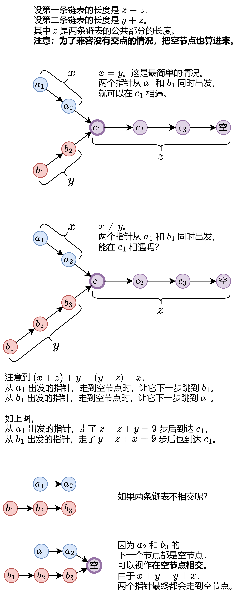

# 160. 相交链表


```go
/**
 * Definition for singly-linked list.
 * type ListNode struct {
 *     Val int
 *     Next *ListNode
 * }
 */
func getIntersectionNode(headA, headB *ListNode) *ListNode {

}
```

### 解决

#### 哈希
>
> 暴力破解，将A全部节点加入map,再遍历B节点，如果map中存在，则返回该节点

```go
func getIntersectionNode(headA, headB *ListNode) (ans *ListNode) {
    var headMap = make(map[*ListNode]struct{})
    for headA != nil {
        headMap[headA] = struct{}{}
        headA = headA.Next
    }
    for headB != nil {
        _, ok := headMap[headB]
        if ok {
            return headB
        }
        headB = headB.Next
    }

    return
}
```

时间复杂度 O(N),空间复杂度 O(N)

#### 双指针



```go
func getIntersectionNode(headA, headB *ListNode) (ans *ListNode) {
    if headA == nil || headB == nil {
        return
    }
    p, q := headA, headB
    for p != q {
        if p != nil {
            p = p.Next
        } else { // 如果已经走到最后的空节点
            p = headB // 进入例外一个链表 y
        }
        if q != nil {
            q = q.Next
        } else { // 如果已经走到最后的空节点
            q = headA // 进入例外一个链表 x
        }
    }
    return p
}

```

时间复杂度 O(N),空间复杂度 O(1)

---

> 作者: loommii  
> URL: https://loommii.github.io/zh-cn/leetcode/160_intersection_of_two_linked_lists/  

