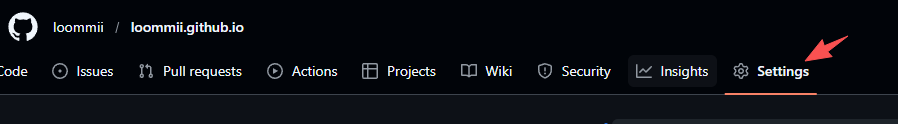
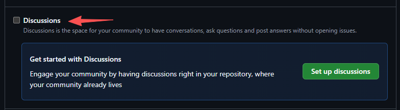
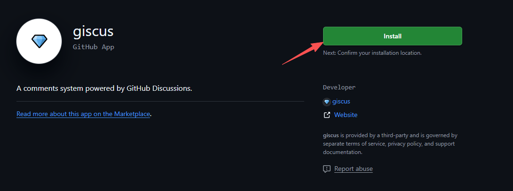
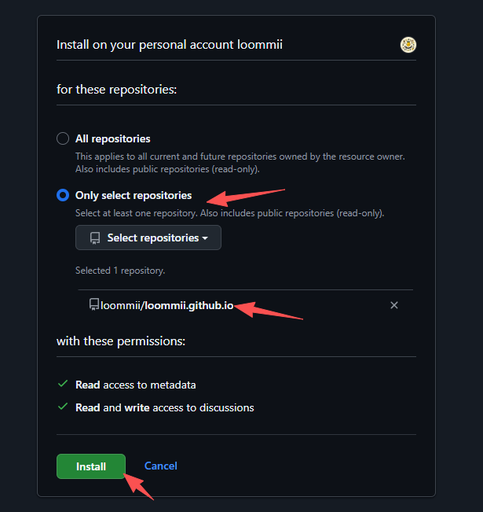
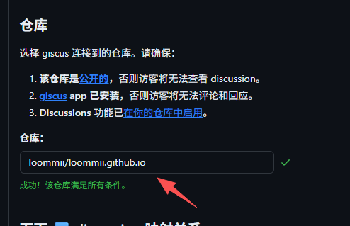
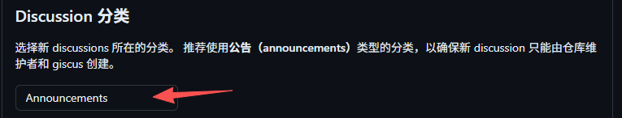
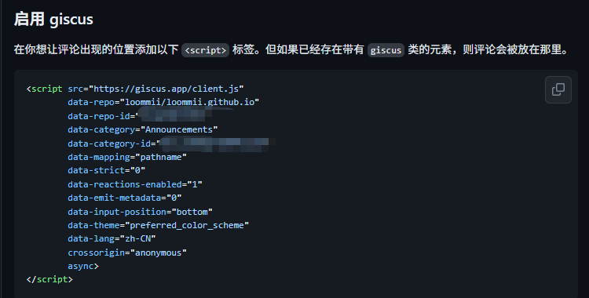
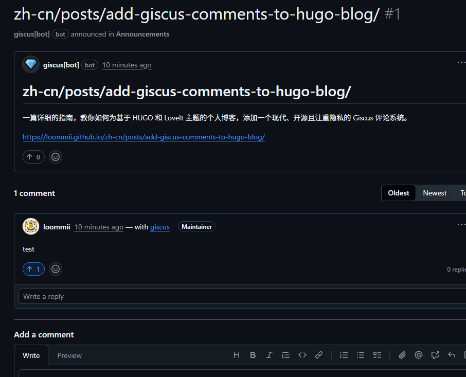
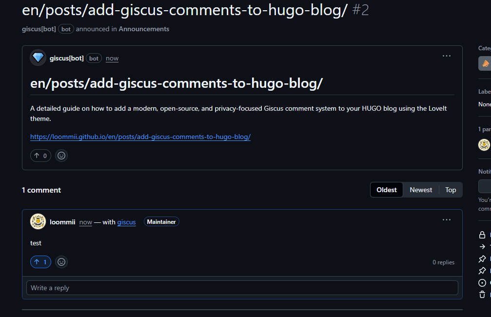

# 为你的 HUGO 博客集成 Giscus 评论系统


## 前言

对于一个个人博客而言，评论系统是与读者建立连接、收集反馈和促进思想交流的关键桥梁。一个活跃的评论区不仅能提升网站的互动性，更能为内容创作者带来持续的写作动力。

目前市面上有许多评论系统方案，例如老牌的 Disqus、基于 GitHub Issues 的 Gitalk 和 Utterances 等。但它们或多或少存在一些缺点，比如 Disqus 的广告和隐私追踪问题，或者 Gitalk/Utterances 对 GitHub Issues 的“污染”。

因此，本文将向您介绍一个更为理想的替代方案：**Giscus**。

**Giscus** 是一个基于 **GitHub Discussions** 的现代评论系统。它开源、免费、无广告、注重隐私，并且完美地将评论区与代码仓库的 Issues 分离开来，非常适合技术类博客。

接下来，我将一步步带您完成在 HUGO (以 LoveIt 主题为例) 博客中集成 Giscus 的全过程。

## 准备工作

在开始之前，请确保您已具备以下条件：

1.  一个正常运行的、基于 HUGO 的个人博客。
2.  博客的源代码托管在一个**公开 (Public)** 的 GitHub 仓库中。
3.  您的 GitHub 账号。

## 第一步：配置 GitHub 仓库与 Giscus 应用

Giscus 需要使用您仓库的 Discussions 功能来存储评论，并需要通过 GitHub App 获取权限。

### 1.1 开启 GitHub Discussions

Giscus 的评论数据将存储在您 GitHub 仓库的 Discussions 中。因此，您需要确保该功能已被激活。

1.  进入您的博客源码所在的 GitHub 仓库。
2.  点击右上角的 **Settings** 标签页。
3.  在 **General** 设置页面下，找到 **Features** 功能区。
4.  勾选 **Discussions** 选项，即可开启此功能。




为了更好地管理，建议为博客评论创建一个专门的分类：

1.  切换到仓库的 **Discussions** 标签页。
2.  点击右侧 **Categories** 旁边的小铅笔图标进行编辑。
3.  点击 **New category**，创建一个新的分类。例如，可以命名为 `博客评论` 或 `Comments`。请确保勾选 **"This category is for announcements."** 选项，这样 Giscus 才能正常使用它。

### 1.2 安装 Giscus GitHub App

Giscus 需要通过 GitHub App 访问您的仓库 Discussions。

1.  访问 [Giscus GitHub App 页面](https://github.com/apps/giscus)。
2.  点击 **Install** 按钮。



3.  选择您需要为其启用 Giscus 的 GitHub Pages 博客仓库，然后点击 **Install**。



## 第二步：配置 Giscus 获取参数

接下来，我们需要在 Giscus 的官方网站上生成配置信息并获取关键 ID。

1.  访问 [giscus.app](https://giscus.app/zh-CN)。
2.  向下滚动页面，找到配置区域。



3.  **仓库**: 输入您的 GitHub 仓库地址，格式为 `用户名/仓库名`。



4.  **页面 ↔️ discussion 映射关系**: 这是 Giscus 的核心功能之一。为了确保您的博客在多平台（如 GitHub Pages, Cloudflare Pages）部署时，同一篇文章能共享同一个评论区，强烈建议选择 **“discussion 标题包含页面 `<title>`”**。
5.  **Discussion 分类**: 选择您在第一步中创建的分类（例如 `博客评论` 或 `Announcements`）。
6.  **功能**: 按需勾选，例如 “开启 Giscus 时加载评论” 等。
7.  **主题**: 推荐选择 `preferred_color_scheme`，这样 Giscus 的外观可以根据访问者系统的亮暗模式自动切换，与您的博客主题保持一致。

完成上述配置后，网站会自动生成一段 `<script>` 标签代码。



但对于 LoveIt 主题，我们**不需要**直接复制整个脚本，只需要从里面提取几个关键的 ID 信息：

- `data-repo-id`
- `data-category-id`

请将这两个 ID 复制下来，它们是下一步配置的关键。

### 补充说明：为何不直接使用 `<script>` 标签？

敏锐的读者可能会问：既然 Giscus 官网已经生成了完整的 `<script>` 标签，为什么我们不直接把它复制到项目里，而是要费力地在 `params.toml` 中重新配置呢？

这是一个很好的问题，答案在于 **“配置与视图分离”** 的设计思想，这也是 HUGO 主题开发的最佳实践。

- **视图（Layout）**: 主题的 HTML 模板文件，负责网页的结构和骨架。
- **配置（Config）**: `hugo.toml` 和 `params.toml` 等文件，负责提供所有可变的参数和数据。

LoveIt 主题已经内置了加载 Giscus 的模板代码（视图）。我们所要做的，就是通过 `params.toml`（配置）告诉模板：“请用这些参数来帮我生成 Giscus 评论区”。

这样做的好处是巨大的：
1.  **易于维护**：当您想更换 Giscus 仓库或修改主题时，只需修改配置文件，而无需深入到复杂的 HTML 代码中。
2.  **保持简洁**：所有配置项集中管理，一目了然。
3.  **主题升级**：未来升级 LoveIt 主题时，您的配置将保持不变，不会因为模板文件的变动而丢失。

Giscus `<script>` 标签中的 `data-*` 属性与 `params.toml` 中的字段有着清晰的对应关系：

| `data-*` 属性 | `params.toml` 键 | 说明 |
| :--- | :--- | :--- |
| `data-repo` | `repo` | 仓库地址 |
| `data-repo-id` | `repoId` | 仓库 ID |
| `data-category` | `category` | 分类名称 |
| `data-category-id`| `categoryId` | 分类 ID |
| `data-mapping` | `mapping` | 映射关系 |
| `data-lang` | `lang` | 显示语言 |
| `data-theme` | `theme` | 评论区主题 |
| `...` | `...` | 其他参数同理 |

理解了这一点后，我们就可以开始配置了。

## 第三步：更新 HUGO 配置文件

现在，我们将 Giscus 的配置信息添加到博客的配置文件中。

1.  打开您项目中的 `config/_default/params.toml` 文件。
2.  在文件末尾添加以下配置块，并填入您刚刚获取的信息：

```toml
# config/_default/params.toml

# 页面评论系统配置
[page.comment]
  enable = true
  # Giscus 评论系统
  [page.comment.giscus]
    enable = true
    # 你的 GitHub 仓库, 格式为 "用户名/仓库名"
    repo = "loommii/blog" # 替换为你的仓库信息
    # 你的仓库 ID, 从 Giscus 官网获取
    repoId = "R_kgDOMf05fA" # 替换为你的仓库 ID
    # 你为评论创建的 discussion 分类名
    category = "Announcements" # 替换为你创建的分类名
    # 你的分类 ID, 从 Giscus 官网获取
    categoryId = "DIC_kwDOMf05fM4ChU0g" # 替换为你的分类 ID
    # 页面与 discussion 的映射关系, 强烈推荐 "title"
    mapping = "title"
    # 其他配置
    strict = "0"
    reactionsEnabled = "1"
    emitMetadata = "0"
    inputPosition = "bottom"
    # 主题语言
    lang = "zh-CN"
    # 评论框主题, preferred_color_scheme 会根据用户系统设置自动切换亮暗模式
    theme = "preferred_color_scheme"
    loading = "lazy"
```

**请务必将 `repo`, `repoId`, `category`, 和 `categoryId` 替换为您自己的信息。**

## 第四步：验证效果

保存好配置文件后，重新启动 HUGO 的本地服务：

```bash
hugo server
```

然后，打开任意一篇文章的页面，滚动到底部。如果一切顺利，您应该能看到 Giscus 评论框已经成功加载。它会提示您通过 GitHub 授权登录，之后便可以发表评论了。

## 参数详解与备选方案

在上面的 `params.toml` 配置中，我们使用了一组推荐的参数。但 LoveIt 主题和 Giscus 还提供了一些其他选项，了解它们可以帮助您进行更深度的定制。

### `lang`：语言设置

-   **`lang = "zh-CN"` (推荐)**: 这是最直接的方式，明确告诉 Giscus 评论区应使用简体中文。
-   **`lang = ""`**: 如果留空，LoveIt 主题会尝试根据您博客的 i18n（国际化）配置来自动设定语言。对于单语言博客，明确指定 `zh-CN` 会更可靠。

### `theme` vs `lightTheme`/`darkTheme`：主题控制

这是一个非常有趣的配置项，体现了 LoveIt 主题的灵活性。

-   **`theme = "preferred_color_scheme"` (最高优先级，推荐)**: 这是 Giscus 官方支持的一个“魔法”值。设置后，Giscus 评论区会**自动跟随用户操作系统的亮/暗模式**进行切换，提供最无缝的视觉体验。当您设置了此项后，下面将要介绍的 `lightTheme` 和 `darkTheme` 将会失效。

-   **`lightTheme` 和 `darkTheme` (主题级控制)**: 这两个是 LoveIt 主题提供的参数。它们允许您**将 Giscus 的主题与您博客主题的亮/暗模式绑定**。
    -   例如，您可以设置 `lightTheme = "light"`，`darkTheme = "noborder_dark"`。当您的博客切换到暗色模式时，LoveIt 主题会自动将 Giscus 的主题设置为 `noborder_dark`。
    -   **注意**：要使用这两个参数，您必须**删除或注释掉 `theme = "preferred_color_scheme"` 这一行**。

**总结一下**：
-   想要最省心、最智能的体验，就用 `theme = "preferred_color_scheme"`。
-   想要对亮/暗模式下的 Giscus 主题进行精细控制，就去掉 `theme` 参数，改用 `lightTheme` 和 `darkTheme`。

## 总结

通过以上几个步骤，我们成功地为 HUGO 博客集成了一个功能强大且尊重隐私的 Giscus 评论系统。它不仅提升了博客的互动体验，也让评论管理变得异常轻松。

希望这篇指南能对您有所帮助！

## 进阶：解决多语言评论不统一的问题

在您发布了文章并切换不同语言版本后，可能会发现一个严重的问题：**中文和英文文章下的评论区是独立的，数据不互通**，这违背了我们统一评论区的初衷。

### 问题复现

例如，您会发现 Giscus 为中文版的文章创建了一个基于其路径的 Discussion：



同时，又为英文版的文章创建了另一个完全独立的 Discussion：



### 问题根源

这个问题的根源在于 Giscus 配置中的 `mapping` 策略。如果您使用了 `mapping = "pathname"`，Giscus 会根据页面的 URL 路径来查找或创建 Discussion。在多语言网站中，同一篇文章的路径因为包含语言前缀（如 `/zh-cn/` 和 `/en/`）而变得不同，因此 Giscus 会误认为它们是两篇不同的文章。

### 解决方案：使用唯一标识符

要解决这个问题，我们需要为同一篇文章的所有语言版本提供一个**完全一致的、唯一的标识符**。Giscus 的 `specific` 映射模式正是为此而生。

#### 第一步：修改文章元数据 (Front Matter)

为您这篇指南文章的**中、英文两个版本** (`index.md` 和 `index.en.md`) 的 Front Matter 中，都添加上同一个 `giscus_id` 字段。这个 ID 的值可以是任何能唯一标识这篇文章的字符串。

```yaml
# --- 文章元数据 ---
title: "为你的 HUGO 博客集成 Giscus 评论系统"
giscus_id: "hugo-giscus-comments-guide" # 保证中英文版本一致
date: ...
---
```

#### 第二步：修改 `params.toml` 配置文件

接着，更新 Giscus 的配置，告诉它使用我们刚刚定义的字段作为映射依据。

```toml
# --- config/_default/params.toml ---
[page.comment.giscus]
  ...
  # 将 mapping 设置为 "specific"，并指定 term 为您在 Front Matter 中定义的字段名
  mapping = "specific"
  term = "giscus_id"
  ...
```

完成这两步修改后，Giscus 就会使用 `hugo-giscus-comments-guide` 这个独一无二的 ID 去关联评论区，从而确保中英文文章共享同一个评论池。

---

> 作者: loommii  
> URL: https://loommii.github.io/zh-cn/posts/add-giscus-comments-to-hugo-blog/  

