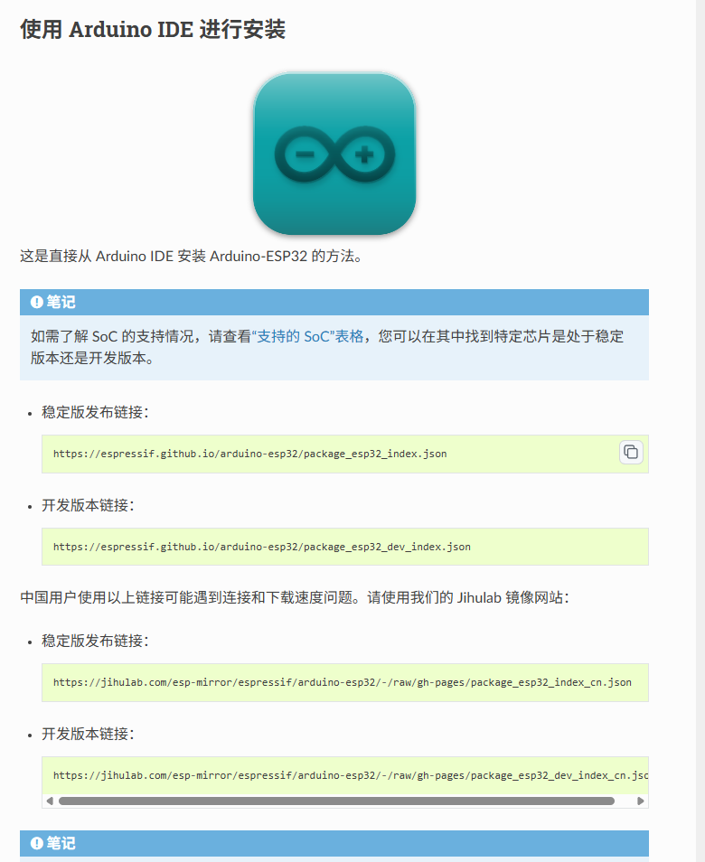
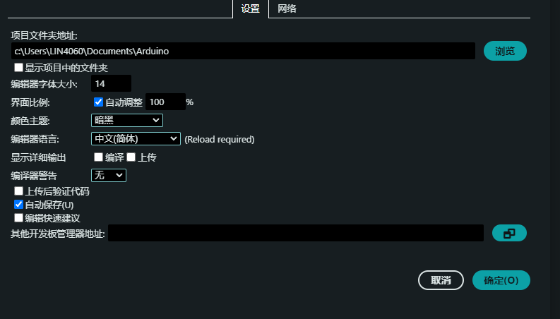
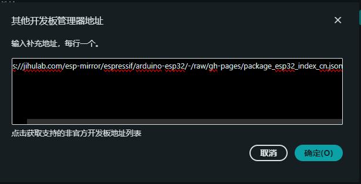
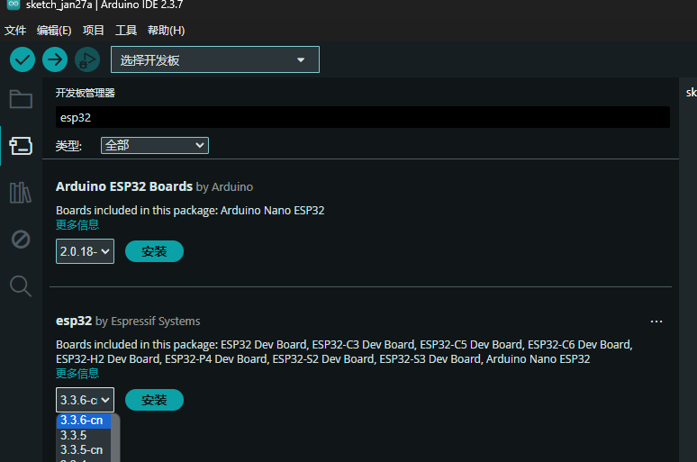

# Arduino IDE 安装 ESP32 开发板：使用国内镜像加速


## 前言：解决 Arduino IDE 下载 ESP32 开发板包失败问题

在中国大陆，Arduino 开发者在使用 Arduino IDE 安装 ESP32 开发板支持包时，常遇到下载缓慢、超时甚至失败的问题。这通常是由于国际网络连接的不稳定性，导致从官方源下载困难。

为了解决这一痛点，本教程将指导您如何通过配置国内镜像源，实现 ESP32 开发板包的快速、稳定安装。告别漫长等待与反复失败，让您的开发过程更加顺畅。


## 第一步：获取 ESP32 国内镜像地址

首先，我们需要获取由官方提供的、托管在国内服务器上的开发板管理器索引文件的 URL。ESP32 的官方文档中明确提供了这些信息，如下图所示。



为了方便您使用，我将它们直接从文档[Installing - Arduino-ESP32](https://docs.espressif.com/projects/arduino-esp32/en/latest/installing.html)中摘录在下方：

-   **稳定版 (Stable)**：包含经过测试、建议大多数用户使用的版本。
    ```
    https://jihulab.com/esp-mirror/espressif/arduino-esp32/-/raw/gh-pages/package_esp32_index_cn.json
    ```

-   **开发版 (Development)**：包含最新的功能和代码，可能不稳定，适合希望尝鲜的开发者。
    ```
    https://jihulab.com/esp-mirror/espressif/arduino-esp32/-/raw/gh-pages/package_esp32_dev_index_cn.json
    ```

对于大多数开发场景，**强烈建议使用稳定版链接**。

## 第二步：在 Arduino IDE 中添加镜像源

获取 URL 后，我们需要让 Arduino IDE 知道这个新的下载地址。

1.  打开 Arduino IDE，点击左上角菜单 **文件 (File)** > **首选项 (Preferences)**。

    

2.  在弹出的“首选项”窗口中，找到 **“附加开发板管理器网址” (Additional Boards Manager URLs)** 的输入框。

    

3.  将第一步中获取的**稳定版 URL** 粘贴到这个输入框中。如果您之前已经添加了其他 URL，请点击输入框右侧的图标，在新窗口中换行粘贴，确保每个 URL 独占一行。


4.  点击 **“确定”** 保存设置。

## 第三步：通过开发板管理器安装 ESP32

配置完成后，我们就可以开始真正的安装了。

1.  在 Arduino IDE 中，通过菜单 **工具 (Tools)** > **开发板 (Board)** > **开发板管理器... (Boards Manager...)** 打开开发板管理器。

2.  开发板管理器打开后，它会首先更新索引，这个过程可能会需要一点时间。更新完成后，在顶部的搜索框中输入 `ESP32`。

3.  您会看到搜索结果中出现了 `esp32 by Espressif Systems`。点击它，在右侧的版本选择下拉菜单中，您会惊喜地发现一些带有 `-cn` 后缀的版本。

    

    **这些 `-cn` 结尾的版本就是通过我们配置的国内镜像源提供的。**

4.  选择一个最新的 `-cn` 版本，然后点击 **“安装” (Install)** 按钮。

现在，您会发现下载速度有了质的飞跃，再也不用经历漫长的等待和反复失败的折磨了。

## 总结

通过简单三步，我们成功地将 Arduino IDE 的开发板下载源切换到了国内镜像，彻底解决了 ESP32 开发板包安装困难的问题。这个方法不仅适用于 ESP32，也同样适用于其他提供了国内镜像的开发板（例如 ESP8266 等）。

**核心要点回顾：**
- **找对源头**：获取官方认证的国内镜像 URL。
- **配置 IDE**：在“首选项”中添加该 URL。
- **选择“-cn”版本**：在“开发板管理器”中安装带有 `-cn` 标识的版本。

希望这篇详细的指南能够帮助您扫清学习和开发道路上的障碍，让您能更专注于创造和实现自己的想法。祝您编程愉快！

---

> 作者: loommii  
> URL: https://loommii.github.io/zh-cn/posts/arduino-ide-esp32-mirror-install-guide/  

