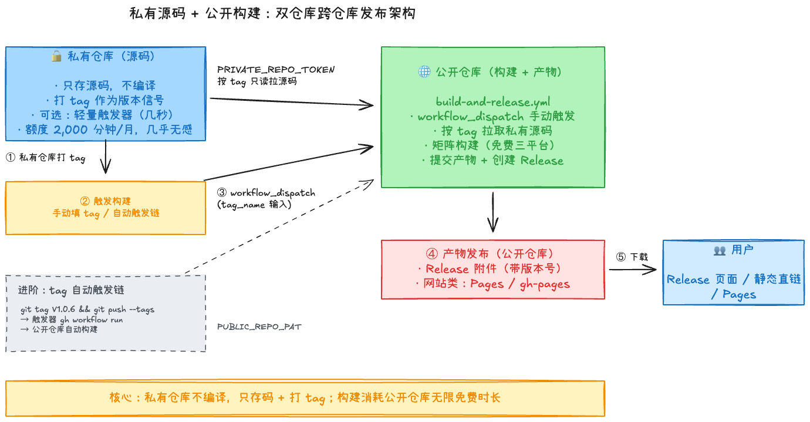

# 双仓库自动发布：私有仓库存代码，公开仓库跑构建


## 背景

有些项目，我们希望**源码保持私有**，但**构建产物公开**：

- 源码包含核心逻辑、配置、协议实现，属于核心资产，需要保密
- 编译后的产物（固件 `.bin`、静态网站、安装包等）需要公开给用户下载或访问

单仓库做不到两全：全公开则源码暴露；全私有则用户拿不到产物，而且构建也受私有仓库的额度限制。

**双仓库架构**正是为了解决这个问题：

- **私有仓库**：只存放源码、配置、构建配置——它不负责构建
- **公开仓库**：负责构建和存放产物，对用户提供下载

## 核心思路：私有仓库只存代码，公开仓库负责构建

双仓库架构面临一个现实约束：**GitHub Actions 对私有仓库每月仅提供 2,000 分钟免费时长**（Free 套餐），而**公开仓库的 Actions 时长完全免费、无限量**——连 macOS / Windows 这些高单价 runner 也不计费。

> 来源：[GitHub Actions 计费文档](https://docs.github.com/en/billing/concepts/product-billing/github-actions)

编译恰恰是最耗时的环节——以 ESP-IDF 这类需要容器编译的嵌入式项目为例，单次构建约 10–60 分钟，加上 Tauri 桌面端的三平台矩阵，一次完整发布常需数十分钟。按每个 job 向上取整计费，私有仓库 2,000 分钟的额度经不起几次发布。

所以整个架构的**关键设计**是：

> **私有仓库不编译。** 它只存放源码；构建 workflow 全部放在**公开仓库**，由它拉取私有源码完成编译和发布，消耗的是公开仓库的免费无限时长。

一句话概括这条链路：

**私有仓库存代码、打版本 tag → 公开仓库的 workflow 拉取对应 tag 的私有源码 → 在公开仓库编译 → 产物发布到公开仓库（Release / Pages）**

## 架构概览



## 设计决策：为什么构建放在公开仓库？

| | 公开仓库 | 私有仓库 |
|---|---|---|
| **GitHub-hosted runners 时长** | 无限量（免费） | 2,000 分钟/月（Free 套餐） |
| **Artifact / Cache 存储** | 免费层含制品/缓存额度（以官方文档为准） | 1 GB（Free 套餐） |
| **macOS / Windows runner** | 同样免费 | 同样计入 2,000 分钟且按 10 倍/2 倍计费 |

> 来源：[GitHub Actions 计费文档](https://docs.github.com/en/billing/concepts/product-billing/github-actions) · [社区讨论](https://github.com/orgs/community/discussions/26054)

构建流程放在公开仓库，消耗的就是公开仓库的无限免费额度。以我的固件项目为例：一次「固件 + 三平台桌面客户端」的完整构建约 9-10 分钟，跑在公开仓库上是 **0 成本**；同样的矩阵放在私有仓库，算上 macOS 10 倍计费系数，一次发布就要消耗 100+ 分钟额度。

公开仓库能够拉取私有源码，靠的是 Personal Access Token——workflow 运行在公开仓库的 Actions runner 上，私有源码只在构建期间短暂存在于 runner 中，构建结束即随 runner 销毁，不会进入公开仓库的 Git 历史。

## 前置条件

1. 一个私有仓库：存放源码，项目能在本地正常构建
2. 一个公开仓库：存放 workflow 与构建产物
3. 了解 Fine-grained Personal Access Token 的概念（classic PAT 无法做到单仓库 + 单权限的最小授权，故选用 Fine-grained）

## 第一步：准备 GitHub Personal Access Token

公开仓库的 workflow 需要一个 Token 来拉取你的私有源码。

### 1.1 打开 Token 生成页面

访问：https://github.com/settings/tokens?type=beta

### 1.2 配置 Token

| 字段 | 填写内容 |
|------|---------|
| **Token name** | `PRIVATE_REPO_TOKEN`（任意名称） |
| **Expiration** | 推荐 90 天 |
| **Repository access** | **仅选择你的私有仓库**（最小权限） |
| **Permissions** | **Contents** → **Read-only** |

### 1.3 保存 Token

**立即复制保存**（关闭页面后无法再次查看），然后添加到**公开仓库**：

1. 进入公开仓库的 **Settings** → **Secrets and variables** → **Actions**
2. 点击 **New repository secret**
3. Name: `PRIVATE_REPO_TOKEN`
4. Value: 粘贴刚才复制的 Token

私有仓库这边**什么都不用配**——它只被动地被拉取源码。

## 第二步：创建公开仓库的构建 Workflow

在**公开仓库**中创建 `.github/workflows/build-and-release.yml`。以我的固件项目为例：私有仓库存固件 + 桌面客户端源码，公开仓库手动触发、填入要构建的 tag，拉源码矩阵编译后在当前仓库发布 Release（仓库名请替换为你自己的）：

```yaml
name: Build and Release Firmware + Desktop

# 手动触发：填入私有仓库需要编译的 Tag
on:
  workflow_dispatch:
    inputs:
      tag_name:
        description: 私有仓库需要编译的 Tag（例如 V1.0.6）
        required: true
        default: V1.0.6

concurrency:
  group: manual-build-${{ inputs.tag_name }}
  cancel-in-progress: true

jobs:
  # ── 固件构建（ESP-IDF 容器） ──
  build-firmware:
    runs-on: ubuntu-latest
    container: espressif/idf:v6.0.1
    steps:
      - name: 拉取私有仓库源码
        uses: actions/checkout@v4
        with:
          repository: loommii/esp32-usb-hid-device      # 替换为你的私有仓库
          token: ${{ secrets.PRIVATE_REPO_TOKEN }}
          ref: ${{ inputs.tag_name }}      # 按输入的 tag 拉源码

      - name: 编译并合并为单文件固件
        run: |
          . /opt/esp/idf/export.sh
          idf.py set-target esp32s3
          mkdir -p "$(pwd)/firmware"
          idf.py merge-bin -o "$(pwd)/firmware/firmware.bin" -f raw

      - uses: actions/upload-artifact@v4
        with:
          name: firmware-bin
          path: firmware/firmware.bin

  # ── 桌面客户端构建（矩阵并行，此处以 Tauri 为例，可整段替换为你的构建） ──
  build-desktop:
    strategy:
      matrix:
        include:
          - platform: macos-latest
          - platform: windows-latest
          - platform: ubuntu-22.04
    runs-on: ${{ matrix.platform }}
    steps:
      - name: 拉取私有仓库源码
        uses: actions/checkout@v4
        with:
          repository: loommii/esp32-usb-hid-device      # 替换为你的私有仓库
          token: ${{ secrets.PRIVATE_REPO_TOKEN }}
          ref: ${{ github.event.inputs.tag_name }}

      # ... 你项目的构建步骤，产物用 upload-artifact 上传
      - uses: actions/upload-artifact@v4
        with:
          name: desktop-${{ matrix.platform }}
          path: |
            **/*.dmg
            **/*.exe
            **/*.msi
            **/*.deb
            **/*.AppImage
          if-no-files-found: error

  # ── 发布：在公开仓库创建 Release ──
  release:
    runs-on: ubuntu-latest
    needs: [build-firmware, build-desktop]
    permissions:
      contents: write
    steps:
      - uses: actions/checkout@v4

      - uses: actions/download-artifact@v4
        with:
          path: artifacts

      - name: 在当前仓库创建 Release
        env:
          GH_TOKEN: ${{ secrets.GITHUB_TOKEN }}
        run: |
          set -euo pipefail
          TAG="${{ inputs.tag_name }}"

          # 先删旧 Release，支持幂等重跑
          gh release delete "${TAG}" --yes 2>/dev/null || true
          gh release create "${TAG}" \
            --verify-tag \
            --title "Release ${TAG}" \
            --notes "Release ${TAG}"

      - name: 上传所有产物到 Release
        env:
          GH_TOKEN: ${{ secrets.GITHUB_TOKEN }}
        run: |
          set -euo pipefail
          TAG="${{ inputs.tag_name }}"
          find artifacts -type f | while read -r f; do
            gh release upload "${TAG}" "${f}" --clobber
          done
```

要点说明：

- **`workflow_dispatch` + `tag_name` 输入参数**：在公开仓库 Actions 页面点一下、填入私有仓库的 tag 即可发起构建
- **`ref: ${{ github.event.inputs.tag_name }}`**：checkout 的不是公开仓库自身，而是**私有仓库的指定 tag**——版本完全由 tag 决定
- **三平台矩阵**：macOS / Windows / Linux runner 在公开仓库全部免费，Tauri 这类多平台构建可以放心跑
- **`concurrency` 取消旧构建**：同 tag 重复触发时自动取消排队中的旧 run
- **幂等发布**：先 `gh release delete` 再 `create`，重跑不报错

构建完成后，产物以 Release 附件的形式出现在公开仓库，用户可直接下载。如果是网站类项目，把 Release 段换成推送到 `gh-pages` 分支或 GitHub Pages 部署即可。

## 第三步：发布一个版本

私有仓库这边只需要正常的开发流程：

```bash
# 在私有仓库中
git tag V1.0.6
git push origin V1.0.6
```

然后到**公开仓库 → Actions → Build and Release → Run workflow**，填入刚打的 tag：

```
tag_name: V1.0.6
```

点击运行即可。接下来全自动：公开仓库拉取私有源码的 `V1.0.6` → 矩阵编译 → Release 发布。全程约 10 分钟，消耗的是公开仓库的免费额度。

## 进阶：tag 自动触发链

上面的流程要手动点一次按钮。如果想做到「私有仓库打 tag → 公开仓库自动构建」，可以给私有仓库加一个**轻量触发器**——它只调一次 API，几秒钟结束，私有仓库 2,000 分钟额度几乎无消耗。

### 在私有仓库创建触发器 `.github/workflows/trigger-build.yml`

```yaml
name: Trigger Public Build

on:
  push:
    tags:
      - 'V*'  # 匹配 V1.0.6、V3.0.0 等
  workflow_dispatch:

permissions:
  contents: read

jobs:
  trigger:
    runs-on: ubuntu-latest
    steps:
      - name: Trigger public repo workflow
        env:
          GH_TOKEN: ${{ secrets.PUBLIC_REPO_PAT }}
        run: |
          VERSION="${GITHUB_REF_NAME}"

          echo "触发公开仓库构建: ${VERSION}"

          # 调用 GitHub API，远程触发公开仓库的 workflow_dispatch
          gh workflow run build-and-release.yml \
            --repo loommii/esp32-usb-hid-device-releases \
            --ref main \
            -f tag_name="${VERSION}"

          echo "✅ 已触发公开仓库构建"
```

### 配置触发器 Token

生成一个 Fine-grained PAT：

- **Repository access**：仅选择公开仓库
- **Permissions**：**Actions** → **Read and write**（触发公开仓库 `workflow_dispatch` 需要 `Actions: write`；若改用文末提到的 `repository_dispatch` 事件，则所需权限是 `Contents: Read and write`，二者不要混用）

在**私有仓库**添加 Secret：Name 为 `PUBLIC_REPO_PAT`，Value 为该 Token。

之后发布流程收敛为一句话：

```bash
git tag V1.0.6 && git push origin V1.0.6
```

私有仓库触发器检测到 tag（几秒）→ 远程触发公开仓库 workflow → 公开仓库拉取对应 tag 的私有源码 → 编译 → Release。也可以改用 `repository_dispatch` 事件实现同样效果（公开仓库 `on:` 加 `repository_dispatch`，触发器用 `gh api repos/<owner>/<public-repo>/dispatches` 调用），二者等价，按喜好选择。

## 不同项目的适配示例

这套模式与项目类型无关，只需要替换 workflow 中的**构建步骤**和**发布方式**：

### ESP-IDF 嵌入式固件

```yaml
jobs:
  build-firmware:
    runs-on: ubuntu-latest
    container: espressif/idf:v6.0.1  # ← 关键：指定 ESP-IDF 容器
    steps:
      # ... checkout 私有仓库步骤与主示例相同
      - name: Build
        run: |
          . /opt/esp/idf/export.sh
          idf.py set-target esp32s3
          idf.py merge-bin -o firmware.bin -f raw
```

### PlatformIO 嵌入式固件

```yaml
steps:
  # ... checkout 私有仓库步骤与主示例相同
  - uses: actions/setup-python@v5
    with:
      python-version: '3.11'
  - run: pip install platformio
  - run: pio run      # 产物: .pio/build/<env>/firmware.bin
```

### Hugo 博客

```yaml
steps:
  # ... checkout 私有仓库步骤与主示例相同
  - uses: peaceiris/actions-hugo@v3
    with:
      hugo-version: '0.165.0'
      extended: true
  - run: hugo --minify
  # 产物路径: public/ → 推送到 gh-pages 分支或 Pages 部署
```

我自己就用这套模式同时维护着嵌入式固件发布（私有源码仓库 → 公开 Releases 仓库，含三平台桌面客户端矩阵构建）和博客部署（私有 Hugo 源码 → 公开 GitHub Pages 仓库）——同一条链路，只换了构建步骤和产物发布方式。

## 安全考虑

1. **Token 权限最小化、用途分离**：
   - `PRIVATE_REPO_TOKEN`（存公开仓库）：仅对私有仓库 `Contents` → `Read-only`
   - `PUBLIC_REPO_PAT`（存私有仓库，进阶自动链才需要）：仅对公开仓库 `Actions` → `Read and write`
2. **Repository access 限定到具体仓库**，不要选 All repositories
3. **Token 过期设置**：建议 90 天，定期轮换
4. **Secrets 保护**：Token 以 Secret 形式存储，不会在日志中泄露
5. **构建环境隔离**：每次 workflow 运行在全新的虚拟机/容器中，私有源码构建后即随 runner 回收，不会进入公开仓库的 Git 历史
6. **跨仓库触发验证**：触发器只向指定的公开仓库和 workflow 发起调用，防止误触发

## 常见问题

### Q: 公开仓库能拉取我的私有源码，安全吗？

PAT 以 Secret 形式存在，GitHub 默认对 Actions 日志中的 Secret 值做脱敏（masking），但应避免在 `run` 中打印或编码 Secret，脱敏并非绝对可靠。Token 是 Fine-grained、只读、仅限单个仓库——最坏情况下源码也只可能被读取，写不进去。源码本身也只在 runner 上短暂存在，构建结束即随 runner 回收，不会进入公开仓库的 Git 历史。

### Q: 为什么构建放在公开仓库而不是私有仓库？

因为编译耗时且私有仓库额度有限（2,000 分钟/月，macOS runner 还按 10 倍计费）。构建放在公开仓库，消耗的是**无限免费时长**，私有仓库连 workflow 都可以不配。

### Q: 手动触发会不会很麻烦？

日常发布就是「打 tag → Actions 页面点一下填 tag 号」，两步。如果嫌麻烦，按进阶章节配好触发器后收敛为一句话：`git tag V1.0.6 && git push origin V1.0.6`。

### Q: 可以支持多个私有仓库触发同一个公开仓库吗？

可以。用进阶章节的触发链，给每个私有仓库配触发器指向同一个公开仓库；在公开仓库 workflow 中通过输入参数或 `client_payload` 区分来源，分别处理。

### Q: 构建失败怎么排查？

在**公开仓库**的 Actions 页面查看 workflow 运行日志。常见原因：Token 过期或权限不足、私有仓库代码有编译错误、容器版本与本地开发环境不一致、tag 不存在（注意 checkout 的 ref 是私有仓库的 tag）。

### Q: 如何回滚版本？

公开仓库的 Release 按版本号保留历史，旧版本附件都在；网页直链类产物（如固件 `.bin` 固定路径）每次发布会被覆盖，回滚时可在 Release 页面重新下载旧版本附件。

## 总结

通过双仓库架构 + GitHub Actions，我们实现了：

- ✅ 源码仓库保持私有，保护核心代码；公开仓库负责构建与产物分发
- ✅ **私有仓库不编译**：只存代码、打 tag，2,000 分钟/月额度原封不动
- ✅ 构建在公开仓库执行，三平台矩阵也免费，消耗无限免费时长
- ✅ 手动点按钮即可发布；配好触发器后，一条 `git push --tags` 全自动

核心模式具有通用性：**私有仓库存码打 tag → 公开仓库拉取对应 tag 的私有源码 → 在公开仓库编译 → 产物发布到公开仓库**。无论你是发布固件、写博客还是托管文档，都可以复用这套架构。

---

> 作者: loommii  
> URL: https://loommii.github.io/zh-cn/posts/dual-repo-github-actions-auto-deploy/  

