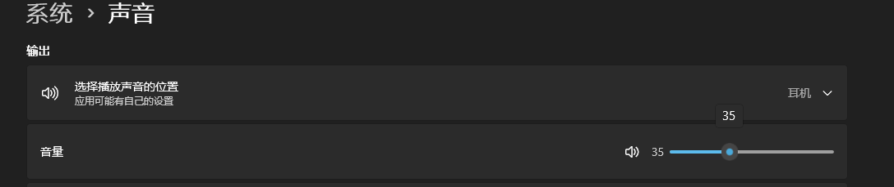
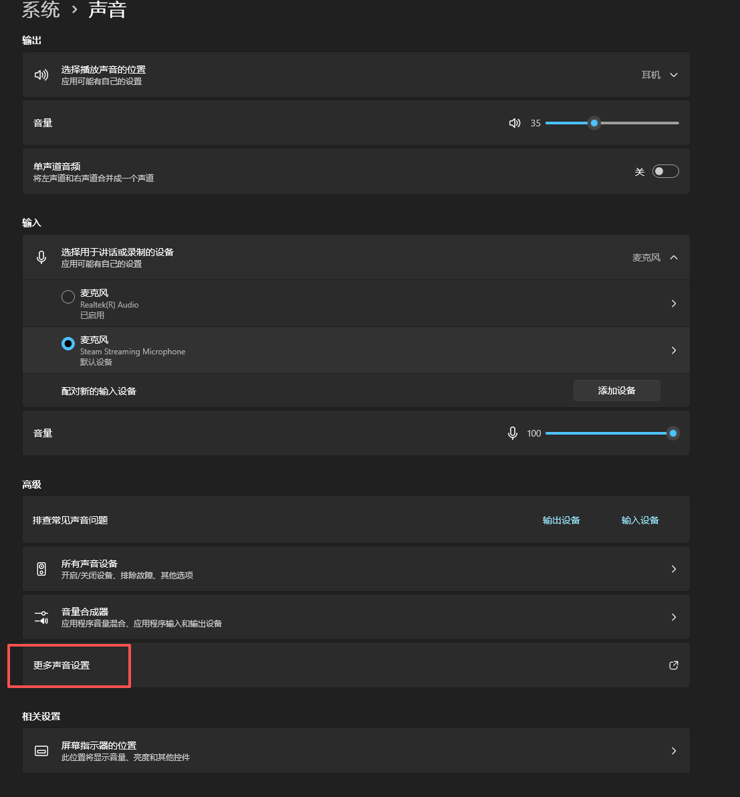
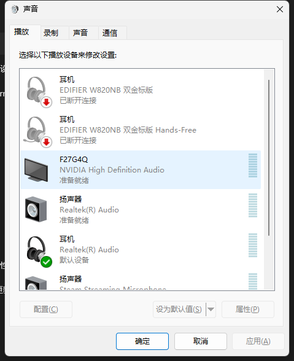
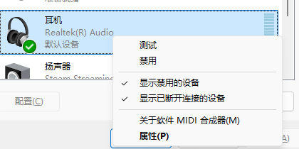
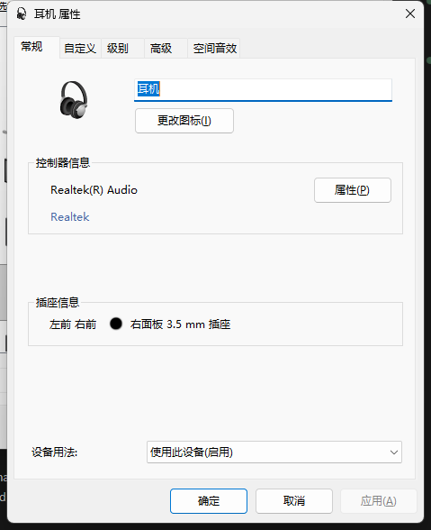
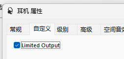

# 解决WIN11耳机音量最大值只能设置到35%的问题

## 问题描述

在 Windows 11 系统中，插入音箱或耳机后，可能会发现音量调节上限被限制在35%，无法继续调高，导致声音非常小。

出现这个问题，通常是因为微软系统出于听力保护的目的，默认启用了一个音量调节上限。

## 解决方案

要解决这个问题，我们需要手动关闭这个限制。

1.  在任务栏右下角的喇叭图标上点击鼠标右键，选择“声音设置”。

    

2.  在声音设置界面中，向下滚动找到并点击“更多声音设置”。

    

3.  在弹出的“声音”配置窗口中，选择“播放”选项卡。

    

4.  找到您正在使用的耳机或音箱设备，在上面点击右键，选择“属性”。

    

5.  在设备属性窗口中，切换到“自定义”选项卡。

    

6.  取消勾选“Limited Output”选项。

    

7.  点击“确定”保存设置。

完成以上步骤后，音量调节的上限限制就被取消了，您可以自由地将音量调节到100%。

---

> 作者: loommii  
> URL: https://loommii.github.io/zh-cn/posts/fix-win11-headphone-volume-limit/  

